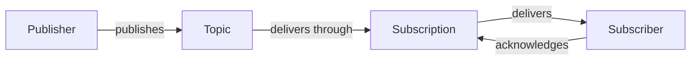
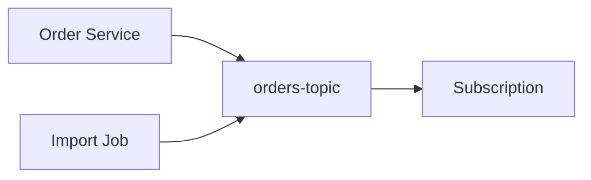
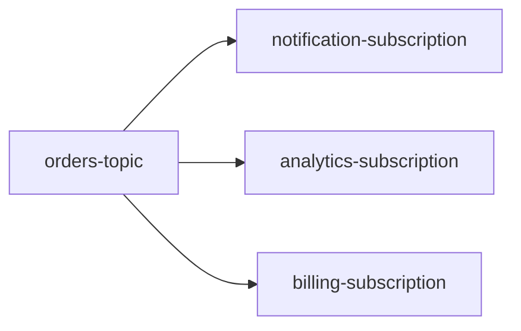
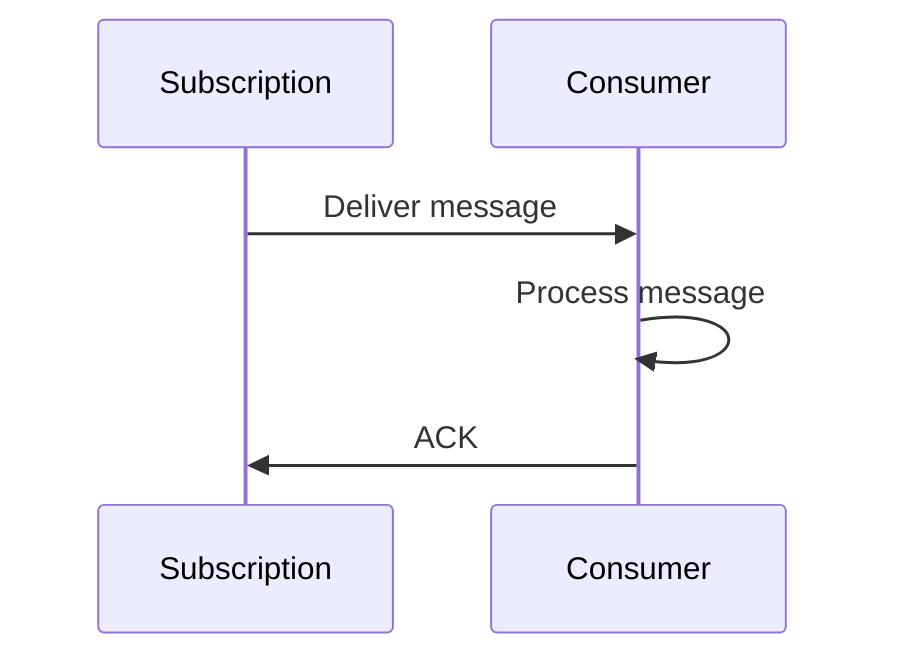
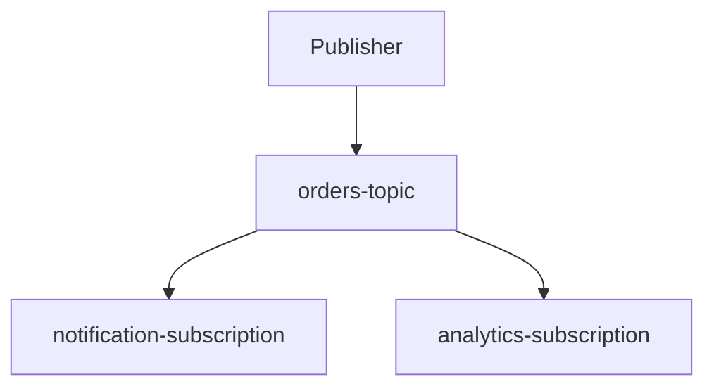
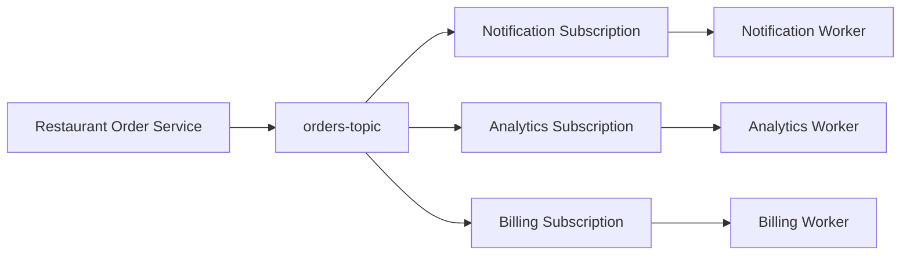

# 02 — Pub/Sub Mental Model 🧠

## 🎯 Learning Objective

Build a clear mental model of the six core Pub/Sub concepts:

- Publisher
- Topic
- Message
- Subscription
- Subscriber
- Acknowledgement

If these concepts are clear, most introductory Pub/Sub architecture becomes much easier to understand.

## The complete model



## 1. Publisher

A **publisher** produces a message.

In a restaurant platform, the order service might publish an `OrderCreated` event.

```text
Restaurant API
      ↓
   Publisher
      ↓
 OrderCreated
```

The publisher generally does not need to know which consumers will process the event.

## 2. Topic

A **topic** is a named destination to which publishers send messages.

Example:

```text
orders-topic
```

Conceptually:



A topic provides the messaging boundary between producers and consumers.

## 3. Message

A **message** is the data being transported.

Example:

```json
{
  "eventType": "OrderCreated",
  "orderId": "ORD-1001",
  "outletId": "OUT-501",
  "amount": 1250
}
```

A message can also have metadata/attributes that help consumers interpret or route processing.

### Good event data

Include information consumers reasonably need, such as:

- Event type
- Entity ID
- Restaurant ID
- Outlet ID
- Event timestamp
- Relevant business values

Avoid turning every event into an unnecessarily large copy of the entire database record.

## 4. Subscription

A **subscription** connects a consumer to a topic.

Think of the topic as the publishing destination and the subscription as the consumer's delivery path.



One topic can therefore support multiple independent consumption paths.

## 5. Subscriber

A **subscriber** is the application, worker or service that processes messages from a subscription.

Example:

```text
analytics-subscription
        ↓
Analytics Worker
```

The subscriber is responsible for business processing and deciding when a delivered message has been successfully handled.

## 6. Acknowledgement

An **acknowledgement (ACK)** tells the messaging system that the subscriber has successfully processed a delivered message.

Conceptually:



If processing fails and the message is not acknowledged, the message may be delivered again according to the service's delivery behavior.

## Topic vs subscription — common confusion ⚠️

A topic is **not** the same thing as a subscription.



Think:

> **Topic = where messages are published.**
>
> **Subscription = how a consumer receives messages from that topic.**

## Restaurant example



The order service does not have to directly invoke all three workers as part of publishing the event.

## Interview checkpoint 💡

**Q: What is the relationship between a topic and subscription?**

A topic receives published messages. A subscription provides a delivery path for a consumer to receive messages from that topic.

**Q: Can a topic have multiple subscriptions?**

Yes. This is useful when different consumers need independent processing of the same event stream.

**Q: Does a subscriber read directly from a topic?**

The subscriber consumes messages through a subscription associated with the topic.

## Mental model to memorize

```text
Publisher
   ↓
 Topic
   ↓
Subscription
   ↓
Subscriber
   ↓
Process
   ↓
 ACK
```

That sequence is the foundation for the rest of this chapter.
