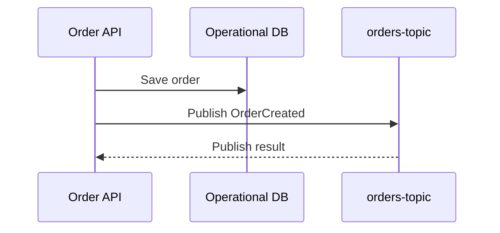

# 03 — Topics, Publishers and Messages 📤

## 🎯 Learning Objective

Understand how publishers produce messages, how topics provide a messaging boundary, and how to design useful event payloads.

## Publisher → Topic

The basic relationship is:


A publisher can be an application, worker, scheduled process or another service.

For the restaurant platform, possible publishers include:

- Order API
- Payment service
- Invoice service
- Data import worker
- Scheduled reconciliation job

## Topics

A topic is a named destination for published messages.

Examples:

```text
orders-topic
payments-topic
invoices-topic
```

A useful topic name communicates the event stream or business domain without embedding a particular consumer into the name.

### Good boundary

```text
orders-topic
```

### More tightly coupled naming

```text
send-email-after-order-topic
```

The second name describes a consumer-specific action rather than a business event stream.

## Messages

A message carries information from the publisher to downstream consumers.

Example `OrderCreated` event:

```json
{
  "eventType": "OrderCreated",
  "orderId": "ORD-1001",
  "restaurantId": "REST-101",
  "outletId": "OUT-501",
  "amount": 1250,
  "currency": "INR",
  "occurredAt": "2026-09-17T12:30:00Z"
}
```

The exact serialization and fields depend on the application's event contract.

## Event type

Consumers need to understand what a message represents.

For example:

```text
OrderCreated
OrderCancelled
OrderCompleted
PaymentCaptured
InvoiceGenerated
```

A consumer can use the event type to choose the appropriate processing path.

## Entity identifiers

Events commonly carry stable identifiers rather than forcing consumers to guess which record they should process.

For example:

```json
{
  "eventType": "OrderCreated",
  "orderId": "ORD-1001",
  "outletId": "OUT-501"
}
```

The consumer can use `orderId` as the business reference for further processing.

## Event payload: full vs minimal

There are two broad approaches.

### Minimal event

```json
{
  "eventType": "OrderCreated",
  "orderId": "ORD-1001"
}
```

Consumers can fetch additional information if required.

### Rich event

```json
{
  "eventType": "OrderCreated",
  "orderId": "ORD-1001",
  "restaurantId": "REST-101",
  "outletId": "OUT-501",
  "amount": 1250,
  "currency": "INR"
}
```

Consumers have more information immediately available.

There is no universal rule that one style is always correct. Consider payload size, consumer needs, consistency, additional reads, coupling and event evolution.

## Message attributes

In addition to the payload, messaging systems can expose message attributes/metadata.

Useful attributes can include:

- Event type
- Source service
- Tenant/restaurant identifier
- Correlation identifier
- Schema/version information

Keep business data and transport metadata conceptually separate.

## Publisher responsibilities

A publisher should generally:

1. Construct a meaningful event.
2. Include stable identifiers.
3. Publish to the correct topic.
4. Handle publishing failures appropriately.
5. Avoid assuming that publishing means every consumer has already processed the event.

That last point is important.

```text
Publish succeeded
      ≠
Consumer processing succeeded
```

## Restaurant order flow



The notification, analytics and billing consumers can process the event independently through their subscriptions.

## Interview checkpoint 💡

**Q: What should an event contain?**

A useful event normally identifies what happened and provides the stable identifiers and information required by consumers. The exact payload is a design decision based on consumer needs and coupling trade-offs.

**Q: Does publishing an event mean the consumer processed it?**

No. Publishing and downstream processing are separate steps.

**Q: Why should an event contain an entity ID?**

It gives consumers a stable reference to the business entity involved in the event and supports further processing or lookup.

## What you should remember

```text
Publisher
   ↓
Business event
   ↓
Topic
   ↓
Independent subscriptions
   ↓
Different consumers
```
