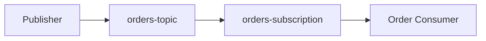
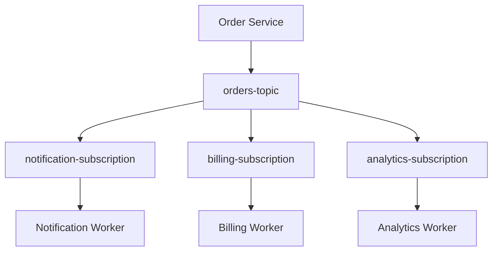
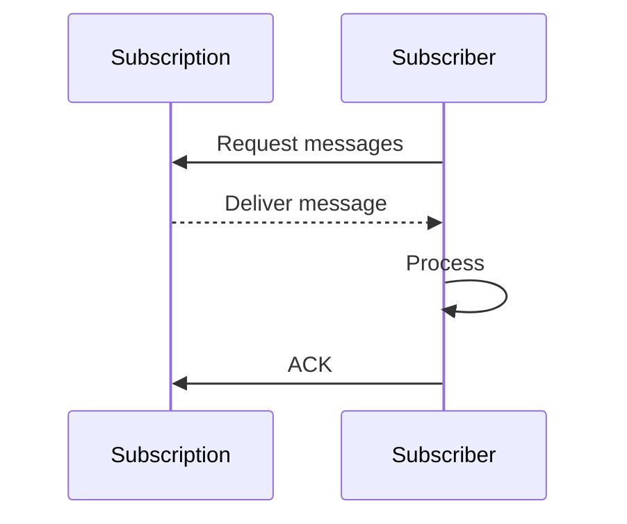
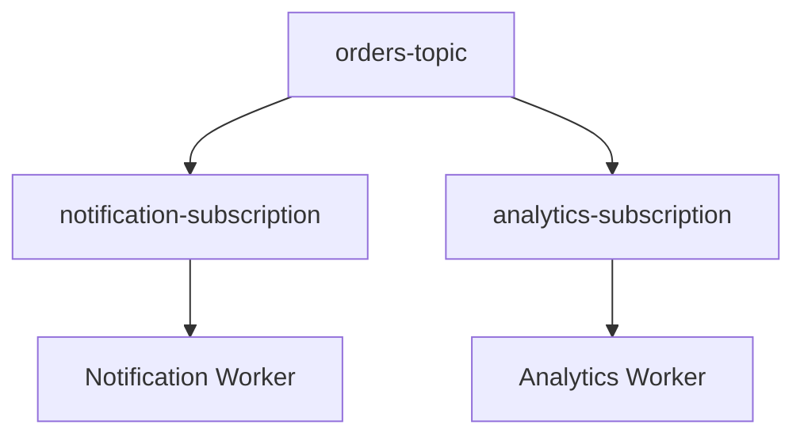
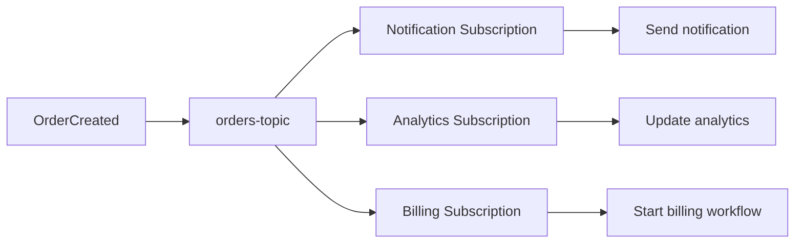

# 04 — Subscriptions and Subscribers 📥

## 🎯 Learning Objective

Understand why subscriptions exist, how subscribers consume messages, and how one topic can support multiple independent consumers.

## Topic vs subscription

A topic is where a publisher sends messages.

A subscription is a delivery path through which a consumer receives messages from a topic.



## Multiple subscriptions

A single topic can have multiple subscriptions.



This is commonly called a **fan-out** pattern: one published event can be independently consumed by multiple processing paths.

## Why separate subscriptions?

Suppose the `OrderCreated` event is relevant to three services.

Using separate subscriptions allows each consumer to have its own delivery and acknowledgement state.

Conceptually:

```text
orders-topic
   ├── notification-subscription
   ├── billing-subscription
   └── analytics-subscription
```

The analytics consumer can process the event independently of the notification consumer.

## Subscriber

A subscriber is the application or worker that consumes messages from a subscription.

Examples:

```text
Notification Worker
Billing Worker
Analytics Worker
Order Processing Worker
```

A subscriber should:

1. Receive a message.
2. Validate it.
3. Perform the required business operation.
4. Handle failures appropriately.
5. Acknowledge the message after successful processing according to the application's delivery design.

## Pull-style mental model

A useful introductory model is:



The exact delivery mechanism can vary by Pub/Sub integration. The important concept is that consumers receive messages through subscriptions.

## Independent consumer state

Consider:



If the analytics worker is temporarily unavailable, its subscription can retain messages for later delivery according to Pub/Sub's configured behavior. The notification path is conceptually independent.

## Subscription configuration

In real systems, subscriptions have configuration that affects delivery and lifecycle behavior.

Topics to understand at interview level include:

- Subscription name
- Associated topic
- Message retention
- Acknowledgement behavior
- Retry behavior
- Dead-letter handling
- Delivery endpoint or subscriber implementation

Not every configuration option needs to be memorized for introductory interview preparation.

## One topic, different consumers

Restaurant example:



The event represents a business fact:

> An order was created.

Each consumer decides what that fact means for its own responsibility.

## Common mistake ⚠️

Do not think of a subscription as simply a filter on a topic.

A subscription is part of the message-delivery relationship with a consumer and maintains the state needed for delivery/acknowledgement according to the service model.

## Interview checkpoint 💡

**Q: Why can one topic have multiple subscriptions?**

To allow different consumers to independently receive and process the same published events.

**Q: Why not make one subscriber call the other services?**

That would move coupling into the subscriber. Separate subscriptions can keep consumers independently responsible for their own processing.

**Q: If two consumers need the same event, should they share one subscription?**

If they are separate processing paths that both need the event independently, separate subscriptions are generally the relevant design. Multiple workers can share a subscription when they are instances of the same logical consumer and should distribute work.

## Key distinction

```text
Multiple workers on ONE subscription
        ↓
Distribute work for one consumer path

Multiple subscriptions on ONE topic
        ↓
Independent consumer paths / fan-out
```
