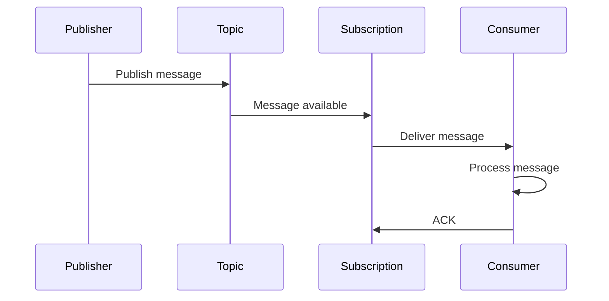
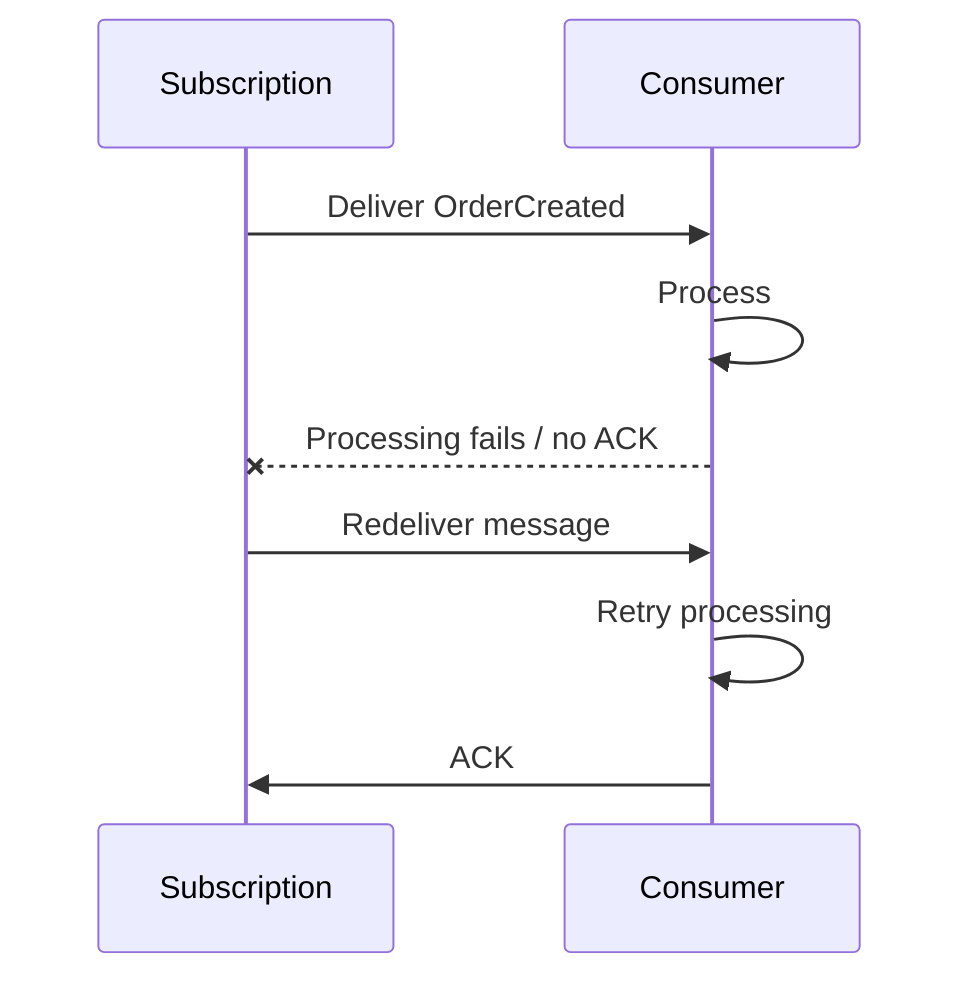
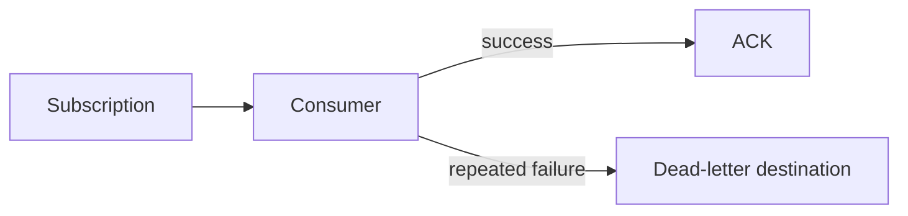

# 05 — Message Delivery and Acknowledgement 🔄

## 🎯 Learning Objective

Understand the most important message-delivery concepts for interviews:

- Delivery
- Acknowledgement (ACK)
- Failure
- Redelivery
- Retries
- Duplicate processing
- Idempotency

## Delivery is not processing

When a subscriber receives a message, it has only **received** the message.

It has not necessarily completed the business operation.

```text
Message delivered
      ↓
Consumer processing
      ↓
Business operation succeeds
      ↓
ACK
```

This distinction is fundamental to reliable event-driven systems.

## Basic delivery flow



An acknowledgement indicates that the subscriber has successfully handled the message according to its processing contract.

## What if processing fails?

Imagine the analytics worker receives:

```text
OrderCreated: ORD-1001
```

but the database is temporarily unavailable.

The consumer may fail to complete processing and therefore not acknowledge the message.

Conceptually:



The exact retry and delivery behavior depends on Pub/Sub configuration and service semantics. The interview-level principle is that failed/unacknowledged work can be delivered again.

## Duplicate processing

A consequence of retryable delivery is that a consumer must be prepared for a message to be processed more than once.

For example:

```text
OrderCreated(ORD-1001)
        ↓
Consumer processes order
        ↓
Network problem before ACK is observed
        ↓
Message delivered again
        ↓
Consumer processes ORD-1001 again
```

This is why **idempotency** matters.

## Idempotency

An operation is idempotent when repeating the same operation does not create an unintended additional effect.

For example, a billing consumer should avoid accidentally charging the customer twice because the same event was delivered twice.

A conceptual design might use an event ID or business operation ID:

```text
Event ID: EVT-9001
Order ID: ORD-1001

Already processed?
   ↓
Yes → do not repeat the side effect
No  → process and record completion
```

The exact implementation depends on the consumer's storage and business requirements.

## ACK timing

A useful principle is:

> Acknowledge after successful processing, not merely after receiving the message.

For example:

```text
Receive
  ↓
Validate
  ↓
Process
  ↓
Persist required state
  ↓
ACK
```

If a consumer acknowledges too early and then crashes, it may lose the opportunity to process the work again through normal redelivery.

## Failure scenarios

| Failure | Important question |
|---|---|
| Consumer crashes | Will the message be delivered again? |
| Database temporarily unavailable | Can processing safely retry? |
| Consumer times out | Could duplicate processing occur? |
| Message is malformed | Should it be retried indefinitely? |
| External API fails | Is the operation idempotent? |

These questions matter more in interviews than memorizing individual configuration flags.

## Dead-letter concept

Some messages may repeatedly fail because the payload is invalid or a downstream dependency cannot process them.

A dead-letter strategy can provide a separate destination for messages that exceed configured retry handling.



Treat dead-letter handling as a reliability pattern rather than as a replacement for fixing application bugs.

## Restaurant example

Suppose billing consumes `OrderCreated`.

```text
OrderCreated
    ↓
Billing Consumer
    ↓
Charge payment
    ↓
Record successful processing
    ↓
ACK
```

If payment processing fails, the consumer must be designed so that retries do not accidentally create multiple charges.

This is a business-critical example of why **delivery semantics and idempotency must be designed together**.

## Interview checkpoint 💡

**Q: Why can a Pub/Sub consumer see a message more than once?**

A message can be redelivered when processing does not complete successfully or the acknowledgement is not successfully registered according to the service's delivery behavior.

**Q: Why is idempotency important?**

Because retryable message processing can result in duplicate deliveries. Consumers need to avoid unintended duplicate side effects.

**Q: When should a consumer acknowledge a message?**

Generally after the required processing has succeeded, based on the application's failure and consistency requirements.

## What you should remember

```text
Delivery
   ↓
Processing
   ↓
Success?
 ┌─┴─┐
Yes  No
 ↓    ↓
ACK  Retry / redelivery
```

And:

> **Design every important consumer with failure and duplicate delivery in mind.**
