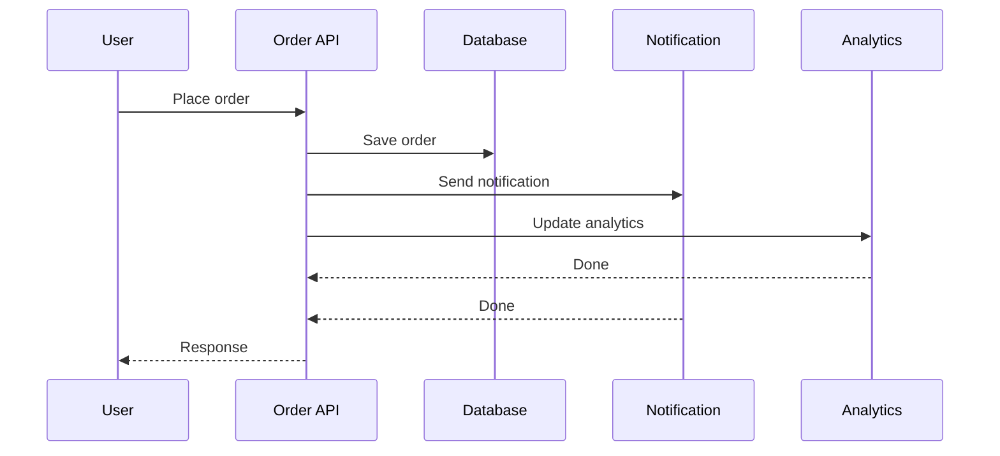
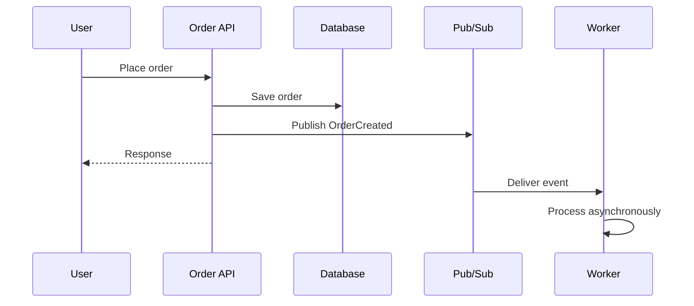
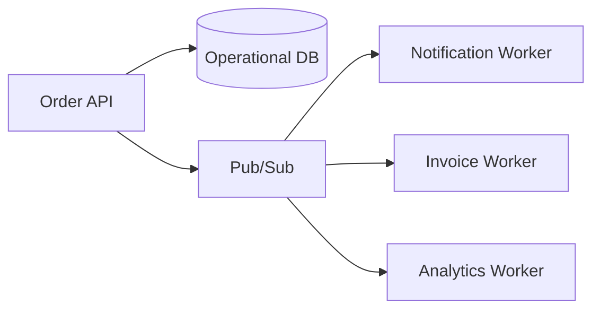

# 06 — Asynchronous Processing ⚡

## 🎯 Learning Objective

Understand why applications use asynchronous processing, what Pub/Sub changes in a request flow, and what new reliability considerations asynchronous architecture introduces.

## Synchronous processing

In a synchronous workflow, the caller waits for downstream operations to complete.



This can be appropriate when every operation is required before the response can be returned.

## Asynchronous processing

With asynchronous processing, the application publishes work and a consumer handles it separately.



The user-facing request does not need to wait for every downstream consumer.

## Why asynchronous processing?

### 1. Decoupling

The producer does not need to directly invoke every consumer.

### 2. Faster request paths

Background work can happen after the application returns the immediate response.

### 3. Independent scaling

Consumers can scale according to their own workload.

### 4. Failure isolation

A temporary downstream failure does not necessarily have to make the original request fail.

### 5. Buffering

Messaging can help absorb temporary differences between the rate at which work is produced and consumed.

## Restaurant example

A customer places an order.

The critical request path might be:

```text
Place order
   ↓
Validate order
   ↓
Persist order
   ↓
Publish OrderCreated
   ↓
Return response
```

Background processing might include:

```text
OrderCreated
   ├── Send notification
   ├── Update analytics
   ├── Start invoice workflow
   └── Trigger other processing
```

Whether a particular operation belongs in the synchronous path depends on the business requirement.

## Eventual consistency

Asynchronous systems often introduce a delay between a change in one service and its observation by another service.

For example:

```text
12:30:00 — Order created
12:30:00 — Order saved
12:30:01 — Analytics event consumed
12:30:01 — Analytics updated
```

For a short period, the operational database and analytical view may not show the same state.

This is one form of **eventual consistency**.

It is not automatically a bug. The architecture must define where temporary inconsistency is acceptable.

## Failure isolation

Suppose the notification service is unavailable.

With direct synchronous calls:

```text
Order API → Notification
             ↓
          Failure
             ↓
       Request impacted
```

With asynchronous processing:

```text
Order API
   ↓
Pub/Sub
   ↓
Notification Worker
   ↓
Temporary failure
```

The event can be handled according to the subscription's delivery/retry behavior while the original request remains separate from the downstream processing path.

## Asynchronous does not mean reliable automatically ⚠️

Introducing Pub/Sub does not eliminate failure.

You still need to consider:

- Duplicate delivery
- Retry behavior
- Idempotency
- Poison messages
- Ordering requirements
- Monitoring
- Backlogs
- Consumer failures
- Eventual consistency

The system becomes decoupled, but it also becomes distributed.

## Choosing synchronous vs asynchronous

| Requirement | Typical consideration |
|---|---|
| User needs immediate result | Synchronous may be appropriate |
| Work can happen later | Asynchronous may be appropriate |
| Several independent consumers | Pub/Sub can provide decoupling |
| Long-running background task | Asynchronous processing is often useful |
| Strong immediate consistency required | Carefully evaluate async design |
| Temporary downstream failures are acceptable | Async buffering/retry can help |

These are architectural considerations, not absolute rules.

## Interview scenario 💡

**Question:** A restaurant order API sends an email, updates analytics and generates an invoice before responding. What problems could this create?

Think about:

1. Increased response latency.
2. Coupling between services.
3. Failure propagation.
4. Different scaling requirements.
5. What work actually needs to complete before the user receives a response?

A possible redesign is:



The important interview skill is explaining **why** the boundary exists, not simply saying “use Pub/Sub.”

## What you should remember

```text
Synchronous
Caller waits

Asynchronous
Caller publishes work
       ↓
Consumer processes later
```

Asynchronous architecture can improve decoupling and resilience, but it introduces distributed-system concerns that must be handled deliberately.
