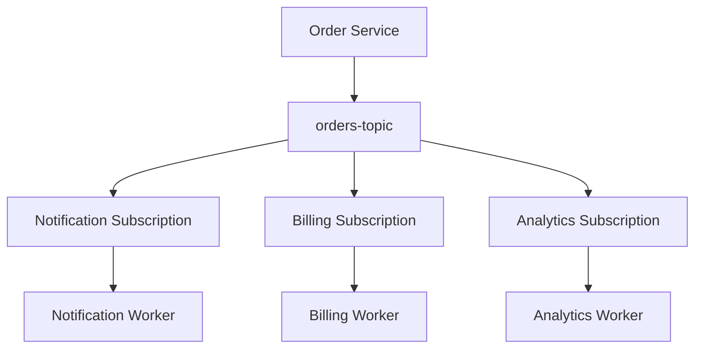
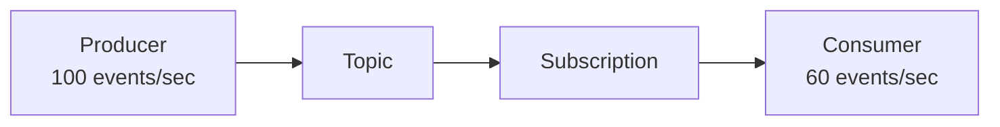
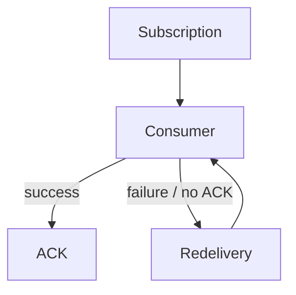
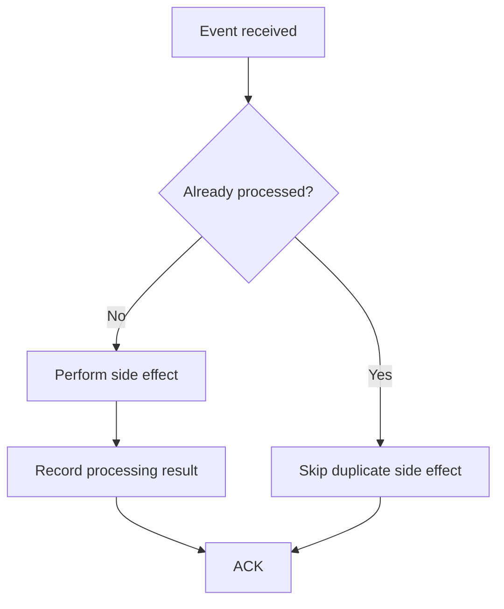
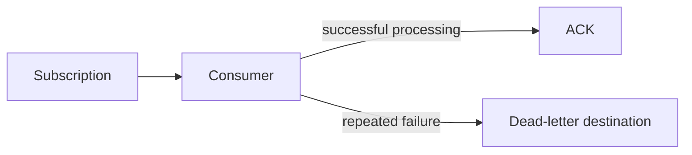
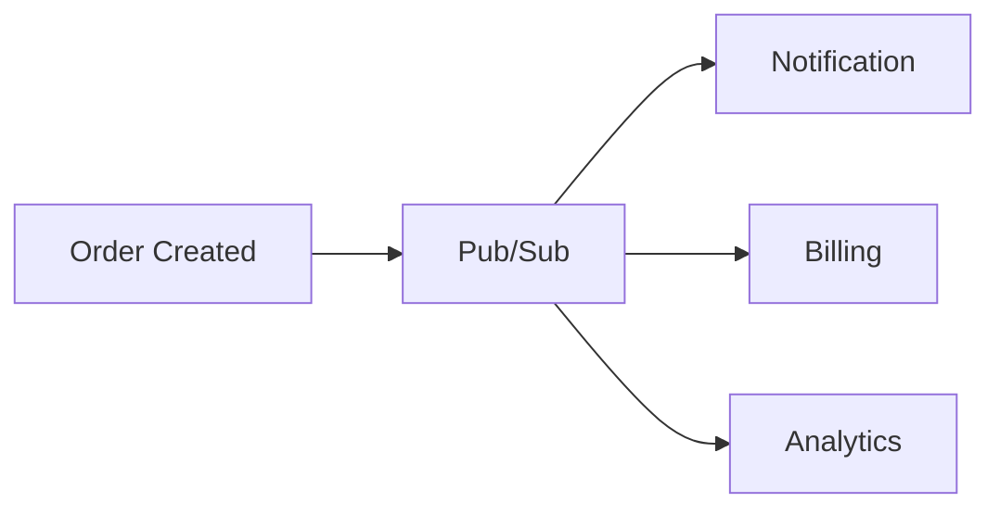
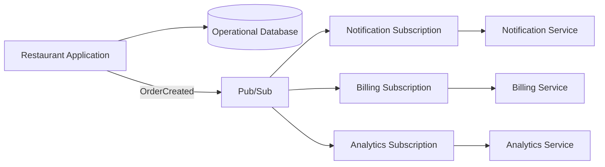

# 07 — Pub/Sub Patterns and Architecture 🏗️

## 🎯 Learning Objective

Recognize common Pub/Sub architecture patterns and understand when they solve real application problems.

## 1. Fan-out

One business event can be consumed independently by multiple services.



This keeps each processing path independent.

## 2. Producer-consumer decoupling

Without messaging:

```text
Order Service
   ├──→ Notification Service
   ├──→ Billing Service
   └──→ Analytics Service
```

The producer knows about all three services.

With Pub/Sub:

```text
Order Service
      ↓
 Pub/Sub Topic
      ↓
Independent consumers
```

The producer publishes the business event without directly depending on each consumer's implementation.

## 3. Buffering

Producers and consumers do not always operate at the same rate.



The subscription can represent work waiting for consumer processing according to its retention and delivery behavior.

This is useful during temporary traffic spikes, but it does not remove the need to monitor backlog and consumer capacity.

## 4. Retry and redelivery

A consumer can fail while processing a message.



Consumers should therefore be designed for retry-safe processing.

## 5. Idempotent consumers

Suppose the same event is delivered twice:

```text
OrderCreated ORD-1001
OrderCreated ORD-1001
```

A billing consumer should have a way to determine whether the business operation has already been completed.



The implementation depends on the consumer's data model and business requirements.

## 6. Dead-letter handling

Some messages repeatedly fail processing.

A dead-letter strategy can separate repeatedly failing messages from the normal processing path.



The application can then inspect, repair or reprocess those messages according to its operational process.

## 7. Event-driven workflow

Pub/Sub can form the event backbone of a workflow.



Each consumer can evolve independently as long as the event contract remains compatible.

## Event vs command

A useful interview distinction:

**Event:** something happened.

```text
OrderCreated
PaymentCaptured
InvoiceGenerated
```

**Command:** someone is asking a component to perform an action.

```text
GenerateInvoice
SendOrderNotification
CapturePayment
```

Messaging architectures can use either style, but the semantics should be explicit.

## Restaurant architecture



## What Pub/Sub does not solve by itself

Pub/Sub does not automatically solve:

- Business-level idempotency.
- Incorrect event payloads.
- Broken consumer logic.
- Database transaction boundaries.
- Monitoring requirements.
- Business ordering requirements.
- Data consistency across every service.

It provides messaging capabilities. Application architecture still determines how those capabilities are used.

## Interview checkpoint 💡

**Q: What is fan-out?**

Publishing one event to a topic and allowing multiple independent subscriptions/consumers to process that event for different purposes.

**Q: Why is idempotency important in a Pub/Sub consumer?**

Because retryable delivery can result in duplicate processing, and important side effects must not accidentally happen multiple times.

**Q: Does Pub/Sub guarantee your entire workflow is exactly-once?**

No. Application-level processing and side effects still need appropriate failure and idempotency design.

## What you should remember

```text
Business event
      ↓
    Topic
      ↓
 ┌────┼────┐
 ↓    ↓    ↓
 A    B    C
```

Pub/Sub is most valuable when independent parts of a distributed system need to communicate without being tightly coupled to one another.
