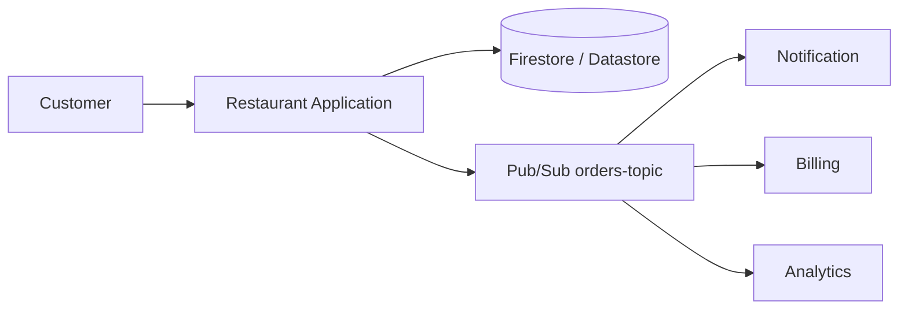
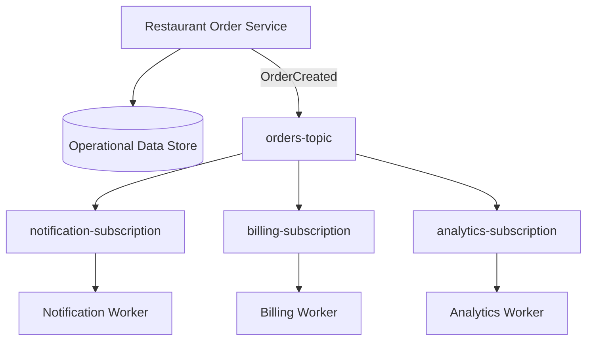
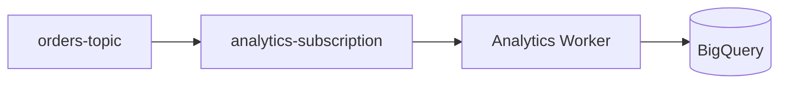
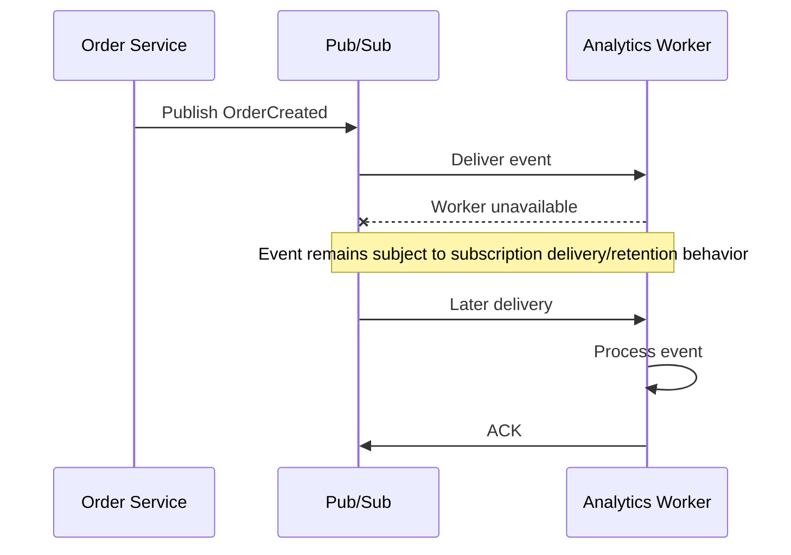
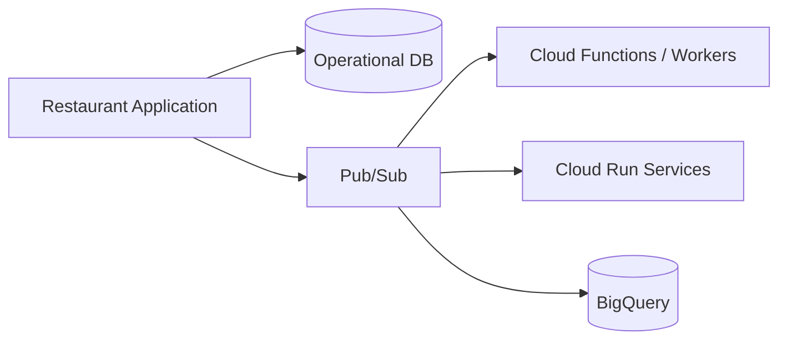

# 08 — Pub/Sub with Restaurant Order Events 🍽️📨

## 🎯 Learning Objective

Connect Pub/Sub to the restaurant SaaS architecture used throughout this tutorial.

The goal is to see how an operational event can trigger multiple independent workflows.

## Restaurant order lifecycle

Consider this simplified flow:



The application remains responsible for its operational data. Pub/Sub carries events to downstream consumers.

## OrderCreated event

When an order is successfully created, the application can publish an event such as:

```json
{
  "eventType": "OrderCreated",
  "orderId": "ORD-1001",
  "restaurantId": "REST-101",
  "outletId": "OUT-501",
  "amount": 1250,
  "currency": "INR",
  "occurredAt": "2026-09-17T12:30:00Z"
}
```

The event represents a business fact:

> **An order was created.**

Consumers decide how that fact affects their own responsibilities.

## Fan-out architecture



## Notification workflow

```text
OrderCreated
    ↓
Notification subscription
    ↓
Notification worker
    ↓
Send customer notification
    ↓
ACK after successful processing
```

If the notification system is temporarily unavailable, the consumer should handle the failure according to the application's retry and delivery strategy.

## Billing workflow

```text
OrderCreated
    ↓
Billing subscription
    ↓
Billing worker
    ↓
Create/prepare billing operation
    ↓
ACK
```

Billing is a good example of why idempotency matters. A repeated event must not accidentally create duplicate financial side effects.

## Analytics workflow



This connects Chapter 8 to Chapter 7.

The operational application creates the business event, while the analytics pipeline can consume the event and update an analytical store.

## Operational vs analytical data

The architecture now has two distinct roles:

| System | Primary purpose |
|---|---|
| Firestore / Datastore | Operational application data |
| Pub/Sub | Asynchronous event transport |
| BigQuery | Analytical queries and reporting |

Think:

```text
Operational state
       ↓
Business event
       ↓
Pub/Sub
       ↓
Analytical processing
       ↓
BigQuery
```

## Failure example

Suppose the analytics worker is down.



The important design point is that analytics processing does not need to be embedded directly in the customer-facing order request.

## Multi-tenant restaurant SaaS

Because this is a multi-tenant system, events should identify the business context required by consumers.

For example:

```json
{
  "eventType": "OrderCreated",
  "restaurantId": "REST-101",
  "outletId": "OUT-501",
  "orderId": "ORD-1001"
}
```

Consumers must enforce appropriate tenant isolation when reading or writing application data.

## Architecture evolution

This chapter's architecture can later grow into:



The later chapters will introduce these services individually. Do not assume that every integration shown above is available in Floci.

## Interview checkpoint 💡

**Q: Why publish `OrderCreated` instead of directly calling notification, billing and analytics services?**

Pub/Sub can decouple those processing paths and allow each consumer to process the business event independently.

**Q: Why should the event contain `restaurantId` and `outletId`?**

They provide business context needed for tenant-aware processing and downstream lookups.

**Q: Why send order events to BigQuery asynchronously?**

Analytics usually does not need to block the customer-facing order request, and asynchronous processing separates operational transactions from analytical workloads.

## What you should remember

```text
Restaurant Application
        ↓
Operational Database
        ↓
   OrderCreated
        ↓
     Pub/Sub
   ↙    ↓    ↘
Notify Billing Analytics
             ↓
          BigQuery
```

This is the core architecture that the Chapter 8 labs will implement conceptually and, where supported, locally through Floci.
