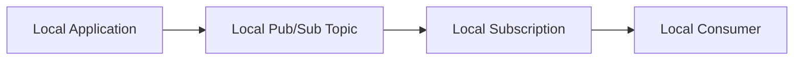
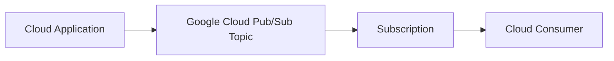

# 09 — Floci vs Real Pub/Sub ⚠️

## 🎯 Learning Objective

Understand which parts of Pub/Sub you can practice locally and which concepts must be verified against real Google Cloud behavior.

## Why this distinction matters

Floci is used in this tutorial to provide a local-first learning environment.

That is useful for:

- Practicing commands.
- Understanding resource relationships.
- Building small workflows.
- Repeating experiments safely.
- Learning without depending on a cloud billing account.

However:

> **A local emulator is not automatically a complete copy of production Google Cloud.**

## Conceptual comparison

| Area | Floci / local environment | Real Google Cloud |
|---|---|---|
| Execution | Local | Managed Google Cloud |
| Authentication | Local configuration may differ | IAM and Google Cloud identity |
| Topics | Use features supported by Floci | Managed Pub/Sub topics |
| Subscriptions | Use features supported by Floci | Managed Pub/Sub subscriptions |
| Delivery | Verify actual local behavior | Production Pub/Sub delivery semantics |
| Scaling | Limited by local environment | Managed cloud infrastructure |
| IAM | May be simplified | Full GCP IAM integration |
| Monitoring | Local tooling | Cloud Logging / Monitoring integrations |
| Cost | Local resources | Cloud usage and billing |

## Local mental model



The architecture is useful even when the infrastructure is local.

## Real GCP mental model



The same conceptual model remains:

```text
Publisher
   ↓
Topic
   ↓
Subscription
   ↓
Subscriber
```

The surrounding infrastructure, identity, networking, scaling and operational behavior are different.

## Commands: verify instead of assuming

Before using a command in a lab, check what your local environment exposes.

For example:

```bash
gcloud pubsub --help
gcloud pubsub topics --help
gcloud pubsub subscriptions --help
```

If a command or feature is not supported by the local emulator, do not force the exercise to use it.

Instead, document:

1. The production GCP concept.
2. What the local environment supports.
3. What you can demonstrate locally.

## Production-only considerations

Real deployments introduce concerns such as:

- IAM permissions.
- Service identities.
- Regional architecture decisions.
- Monitoring and alerting.
- Capacity and scaling.
- Security.
- Production retry/dead-letter configuration.
- Cost management.

These belong to the broader production architecture taught later in the tutorial.

## Interview framing 💡

If asked:

> “Have you used Google Cloud Pub/Sub?”

A precise answer should distinguish hands-on emulator practice from production cloud experience.

For example:

> “I practiced Pub/Sub concepts locally using a GCP-compatible emulator, including topics, subscriptions and message workflows. I understand that the local emulator does not reproduce every production GCP capability, so I verify production-specific behavior against Google Cloud documentation.”

This is more accurate than claiming that emulator behavior is identical to production.

## Common mistake ⚠️

Do not write a tutorial step such as:

> “This works in Floci, therefore it works exactly the same way on GCP.”

Instead:

> “This demonstrates the Pub/Sub concept locally; production behavior and supported configuration should be verified on real GCP.”

## What you should remember

```text
Floci
  ↓
Learn the concept
  ↓
Practice the local workflow
  ↓
Understand limitations
  ↓
Map the concept to real GCP
```

That distinction is part of the interview preparation, not just a tooling disclaimer.
