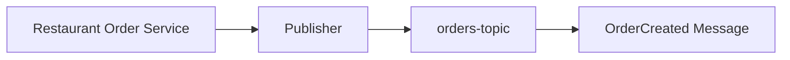
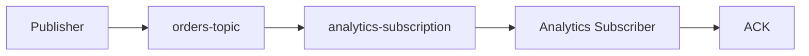
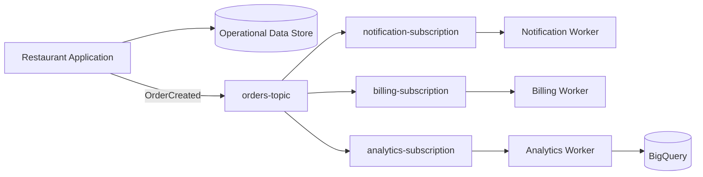

# 10 — Hands-On Labs 🧪🚀

## 🎯 Lab Philosophy

These labs are designed for both practical learning and interview preparation.

The goal is not to memorize Pub/Sub commands. You should be able to explain:

> **What event am I publishing, who needs it, why use Pub/Sub, what happens if processing fails, and how would this architecture run on real GCP?**

> ⚠️ **Floci note:** Pub/Sub support can differ from real Google Cloud. Verify commands and supported features in your local environment before running each exercise.

---

# Lab 0 — Environment Check 🔎

## Goal

Confirm that the local environment exposes the Pub/Sub commands needed for the labs.

## Check the CLI

```bash
gcloud --version
gcloud pubsub --help
gcloud pubsub topics --help
gcloud pubsub subscriptions --help
```

On Windows PowerShell, the same commands can be used.

If a command is unavailable, inspect the available help output rather than assuming that the emulator supports the production command set.

## Checklist

- [ ] Docker is running.
- [ ] Floci is running.
- [ ] `gcloud` is available.
- [ ] Local project configuration is active.
- [ ] Pub/Sub commands are visible.

---

# Lab 1 — Create a Topic and Publish an Order Event 📤

## Goal

Practice the publisher → topic → message part of the Pub/Sub model.

## Scenario

Your restaurant application publishes an `OrderCreated` event after creating an order.

Target topic:

```text
orders-topic
```

Example message:

```json
{
  "eventType": "OrderCreated",
  "orderId": "ORD-1001",
  "restaurantId": "REST-101",
  "outletId": "OUT-501",
  "amount": 1250,
  "currency": "INR"
}
```

## Step 1 — Inspect available commands

```bash
gcloud pubsub topics --help
```

## Step 2 — Create the topic

Use the topic-creation command supported by your Floci environment.

Conceptually:

```text
orders-topic
```

## Step 3 — Publish the event

Use the supported Pub/Sub publish command to publish the sample event.

## Step 4 — Verify the topic

List or describe the topic using the locally supported command.

## Expected mental model



## Interview challenge 💡

Explain why the publisher does not need to know whether the event will eventually be processed by billing, analytics or notification services.

---

# Lab 2 — Create a Subscription and Consume the Event 📥

## Goal

Practice:

```text
Topic
  ↓
Subscription
  ↓
Subscriber
  ↓
ACK
```

## Scenario

Create an analytics subscription:

```text
analytics-subscription
```

It consumes events from:

```text
orders-topic
```

## Step 1 — Create the subscription

Use the subscription creation command supported by the local environment.

Conceptually:

```text
orders-topic
      ↓
analytics-subscription
```

## Step 2 — Publish another event

Publish a second order event.

Example:

```json
{
  "eventType": "OrderCreated",
  "orderId": "ORD-1002",
  "restaurantId": "REST-101",
  "outletId": "OUT-502",
  "amount": 840,
  "currency": "INR"
}
```

## Step 3 — Pull/consume the message

Use the locally supported subscriber/pull command.

Inspect:

- Message payload.
- Message metadata where available.
- Delivery information where available.

## Step 4 — Acknowledge the message

Use the supported acknowledgement workflow.

Then reason about what should happen when the message is acknowledged versus not acknowledged.

## Expected architecture



## Experiment

Run the consumption workflow and compare:

1. Message received but not acknowledged.
2. Message received and acknowledged.
3. Attempting to consume again after acknowledgement.

Record the actual behavior of your local environment.

> ⚠️ Do not assume that emulator behavior is identical to production Pub/Sub delivery semantics.

## Interview challenge 💡

Explain why a consumer should normally acknowledge a message only after the required processing succeeds.

---

# Final Lab — Restaurant Order Event Pipeline 🚀

## Goal

Combine the concepts from the chapter into one event-driven restaurant workflow.

## Target architecture



## Deliverable 1 — Resource design

Define:

```text
Topic:
orders-topic

Subscriptions:
notification-subscription
billing-subscription
analytics-subscription
```

Explain why there are three subscriptions instead of one.

## Deliverable 2 — Event design

Design an `OrderCreated` event containing at least:

- Event type.
- Order ID.
- Restaurant ID.
- Outlet ID.
- Amount.
- Event timestamp.

Explain why each field exists.

## Deliverable 3 — Failure reasoning

Answer:

1. What happens if the notification worker crashes?
2. What happens if analytics processing fails?
3. What happens if the same event is delivered twice?
4. How can the billing consumer avoid duplicate side effects?
5. What happens if consumers process events slower than producers publish them?

## Deliverable 4 — Architecture explanation

Explain the difference between:

```text
Operational data
      ↓
Firestore / Datastore
```

and:

```text
Business event
      ↓
Pub/Sub
      ↓
Analytics processing
      ↓
BigQuery
```

## Deliverable 5 — Real GCP mapping

For each component, explain its production equivalent:

| Local learning concept | Real GCP concept |
|---|---|
| Local topic | Google Cloud Pub/Sub topic |
| Local subscription | Google Cloud Pub/Sub subscription |
| Local consumer | Cloud/application subscriber |
| Local analytics destination | BigQuery |

Do not claim that every local command or configuration maps one-to-one to production.

## Final interview questions 🎤

1. Why use Pub/Sub here?
2. Why not call all three services synchronously?
3. Why are there multiple subscriptions?
4. What is the role of the topic?
5. What is the role of the subscription?
6. What happens if a consumer fails?
7. Why is idempotency important?
8. Where does the operational order live?
9. Where does analytical data live?
10. How would you monitor a growing consumer backlog?

## Completion checklist

- [ ] Created or identified a Pub/Sub topic locally.
- [ ] Published a restaurant order event.
- [ ] Created a subscription where supported.
- [ ] Consumed a message.
- [ ] Practiced acknowledgement.
- [ ] Understood redelivery/failure concepts.
- [ ] Designed fan-out with multiple subscriptions.
- [ ] Explained idempotent consumers.
- [ ] Connected Pub/Sub conceptually to BigQuery.
- [ ] Explained Floci vs real GCP differences.

> 🎯 **Do not move on until you can draw the producer → topic → subscription → consumer flow from memory and explain what happens when processing fails.**
