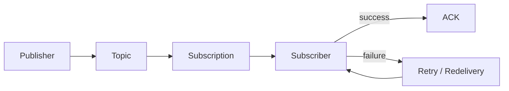

# 11 — Learning Checklist ✅

Use this checklist before moving to Chapter 9.

## Core concepts

- [ ] I can explain what Pub/Sub solves.
- [ ] I understand publisher, topic, message, subscription and subscriber.
- [ ] I understand acknowledgement (ACK).
- [ ] I understand asynchronous processing.
- [ ] I understand fan-out.
- [ ] I understand redelivery and retry concepts.
- [ ] I understand why idempotency matters.
- [ ] I understand the difference between an event and a direct API call.

## Topic and subscription model

- [ ] I can explain why publishers publish to topics.
- [ ] I can explain why subscribers consume through subscriptions.
- [ ] I understand that one topic can have multiple subscriptions.
- [ ] I understand why multiple workers can share one subscription for distributed work.
- [ ] I understand why separate subscriptions create independent consumer paths.

## Message delivery

- [ ] I understand that delivery is not the same as successful processing.
- [ ] I understand why a message can be delivered again.
- [ ] I can explain when a consumer should acknowledge a message.
- [ ] I can explain duplicate processing.
- [ ] I can describe an idempotent consumer at a high level.
- [ ] I understand the purpose of dead-letter handling.

## Asynchronous architecture

- [ ] I can compare synchronous and asynchronous workflows.
- [ ] I understand decoupling.
- [ ] I understand buffering.
- [ ] I understand independent consumer scaling.
- [ ] I understand eventual consistency at a high level.
- [ ] I can identify cases where asynchronous processing may not be appropriate.

## Restaurant SaaS architecture

- [ ] I can design an `OrderCreated` event.
- [ ] I can explain the restaurant → outlet → order context in an event.
- [ ] I can design notification, billing and analytics subscriptions.
- [ ] I can explain the Pub/Sub → BigQuery analytics path.
- [ ] I can explain why operational data and analytical data have different roles.

## Practical skills

- [ ] I verified Pub/Sub commands available in Floci.
- [ ] I created a topic where supported.
- [ ] I published an event where supported.
- [ ] I created a subscription where supported.
- [ ] I consumed a message where supported.
- [ ] I practiced acknowledgement where supported.
- [ ] I recorded any differences observed in the local environment.

## Floci vs real GCP

- [ ] I do not assume emulator behavior equals production behavior.
- [ ] I understand that real GCP adds IAM, managed infrastructure, scaling and operational concerns.
- [ ] I know which parts of my hands-on experience were local/emulator based.

## Interview readiness 🎤

I should be able to answer:

1. What is Pub/Sub?
2. Why use Pub/Sub instead of a direct API call?
3. What is a topic?
4. What is a subscription?
5. Can one topic have multiple subscriptions?
6. What happens when a consumer fails?
7. Why can duplicate messages occur?
8. What is idempotency?
9. What is fan-out?
10. How would you design restaurant order events using Pub/Sub?
11. How would Pub/Sub integrate with BigQuery?
12. What changes when moving from Floci to real GCP?

## Final mental model

> 🎯 **Ready for Chapter 9 when you can explain this diagram without referring to the notes.**
