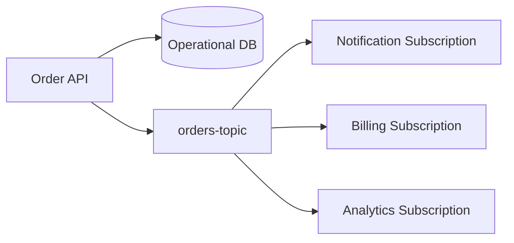
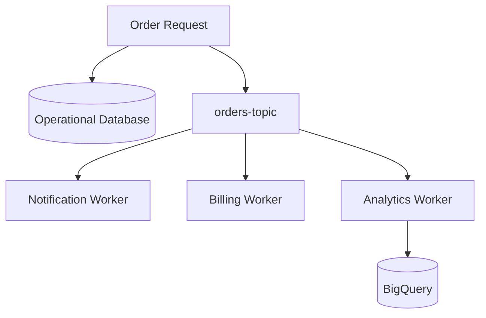

# 99 — Pub/Sub Interview Questions 🎤

## How to use this file

Do not memorize one-line answers only.

For architecture questions, explain:

1. The problem.
2. The communication model.
3. The Pub/Sub resource involved.
4. Failure behavior.
5. Consumer design.
6. Why the design fits the workload.

---

## Beginner

### 1. What is Google Cloud Pub/Sub?

Pub/Sub is a managed messaging service that allows producers to publish messages and consumers to process them asynchronously through subscriptions.

### 2. What is a topic?

A named destination to which publishers send messages.

### 3. What is a subscription?

A consumer delivery path associated with a topic.

### 4. What is a publisher?

A producer that publishes messages to a topic.

### 5. What is a subscriber?

An application or worker that receives and processes messages from a subscription.

### 6. What is an acknowledgement?

A signal from the subscriber indicating that a delivered message has been successfully handled according to its processing contract.

---

## Intermediate

### 7. Why use Pub/Sub instead of a direct API call?

Pub/Sub can decouple producers from consumers and enable asynchronous processing. A direct API call may still be appropriate when the caller needs an immediate response or synchronous business operation.

### 8. Can one topic have multiple subscriptions?

Yes. Multiple subscriptions allow independent consumer paths to receive the same published event.

### 9. Why use multiple subscriptions?

For example, an `OrderCreated` event may need independent notification, billing and analytics processing.

### 10. Can multiple workers consume from one subscription?

Yes. Multiple workers can act as instances of the same logical consumer and distribute processing work.

### 11. What happens if a consumer fails?

If processing does not complete successfully and the message is not acknowledged, the message may be delivered again according to the subscription's delivery behavior.

### 12. Why is idempotency important?

Because duplicate delivery or retry can cause the same message to be processed more than once. Consumers must prevent unintended duplicate side effects.

### 13. Is Pub/Sub a database?

No. Pub/Sub is a messaging service, not the application's primary system of record.

### 14. What is fan-out?

One published event being independently consumed through multiple subscriptions for different processing paths.

---

## Asynchronous processing

### 15. What is asynchronous processing?

The producer initiates work without waiting for the downstream consumer to finish it in the same request path.

### 16. What are the benefits?

Common benefits include decoupling, independent scaling, buffering and separation of user-facing latency from background work.

### 17. What are the drawbacks?

Asynchronous systems introduce additional distributed-system concerns such as eventual consistency, retries, duplicate processing, monitoring and more complex debugging.

### 18. Does asynchronous mean faster overall?

Not necessarily. It can reduce user-facing latency by moving work out of the request path, but the total background processing time may remain similar or increase depending on the architecture.

---

## Reliability

### 19. Why can a message be delivered more than once?

Failure to successfully acknowledge or complete processing can lead to redelivery according to the service's delivery semantics.

### 20. What is idempotent processing?

Processing the same logical operation repeatedly does not create an unintended additional effect.

### 21. How would you prevent duplicate billing?

Use an idempotency strategy based on a stable business/event identifier and record whether the side effect has already been successfully applied. The exact implementation depends on the billing system.

### 22. What is a dead-letter destination?

A separate destination used for messages that repeatedly fail normal processing according to configured retry/dead-letter handling.

### 23. Should you ACK before or after processing?

Normally after the required processing succeeds, unless the application's specific processing contract intentionally uses another strategy.

---

## Restaurant system-design questions 🍽️

### 24. Design an order-event system using Pub/Sub.

A reasonable conceptual design is:

Explain why the operational database and messaging layer have different responsibilities.

### 25. Why not call notification, billing and analytics directly?

Direct calls couple the order request to the availability and latency of each downstream service. Pub/Sub can separate those processing paths when the business requirements permit asynchronous execution.

### 26. What happens if analytics is temporarily down?

The analytics subscription can retain work for delivery according to its configured behavior, while the notification and billing processing paths remain conceptually independent.

### 27. What happens if billing receives the same event twice?

The billing consumer needs idempotent processing so a repeated event does not create an unintended duplicate financial side effect.

### 28. How would Pub/Sub connect to BigQuery?

An analytics consumer or supported integration can consume order events and write analytical data to BigQuery. The exact production architecture depends on the ingestion service and requirements.

---

## Architecture reasoning

### 29. When should you not use Pub/Sub?

Do not introduce messaging merely because it is available. If a caller requires an immediate synchronous result or a direct request/response interaction is simpler and appropriate, a direct API/database interaction may be better.

### 30. What does Pub/Sub decouple?

It can decouple the publisher from the implementation and availability of downstream consumers by introducing an asynchronous messaging boundary.

### 31. Does Pub/Sub solve database transactions across services?

No. Messaging and distributed transaction consistency are separate concerns. The application still needs to define its transaction boundaries and failure strategy.

### 32. Does Pub/Sub guarantee that business side effects happen exactly once?

You should not rely on the messaging layer alone to make arbitrary business side effects exactly once. Consumer idempotency and business-level processing design remain important.

---

## Interview scenario 🎯

### Scenario

A restaurant platform processes a large number of orders during a promotion. Every successful order must trigger:

- Customer notification.
- Billing processing.
- Analytics processing.

### Questions

Explain:

1. What should be synchronous?
2. What can be asynchronous?
3. What topic would you create?
4. How many subscriptions are needed for independent consumers?
5. What happens if analytics is down?
6. What happens if billing processes the same event twice?
7. How would you monitor consumer backlog?
8. Where does the operational order record live?
9. Where does analytical data live?
10. What changes when moving from Floci to real GCP?

### Key diagram

The interview objective is not to reproduce the diagram. Explain the responsibilities and failure boundaries represented by it.

---

## Quick-fire revision

| Question | Short answer |
|---|---|
| Pub/Sub? | Managed asynchronous messaging |
| Publisher? | Produces messages |
| Topic? | Message publishing destination |
| Subscription? | Consumer delivery path |
| Subscriber? | Processes messages |
| ACK? | Confirms successful processing |
| Fan-out? | Multiple independent consumer paths |
| Redelivery? | Message delivered again after unsuccessful/unacknowledged processing |
| Idempotency? | Safe repeated processing without unintended duplicate effects |
| Pub/Sub database? | No |
| Main benefit? | Decoupled asynchronous communication |
| Main reliability concern? | Failure and duplicate processing |
