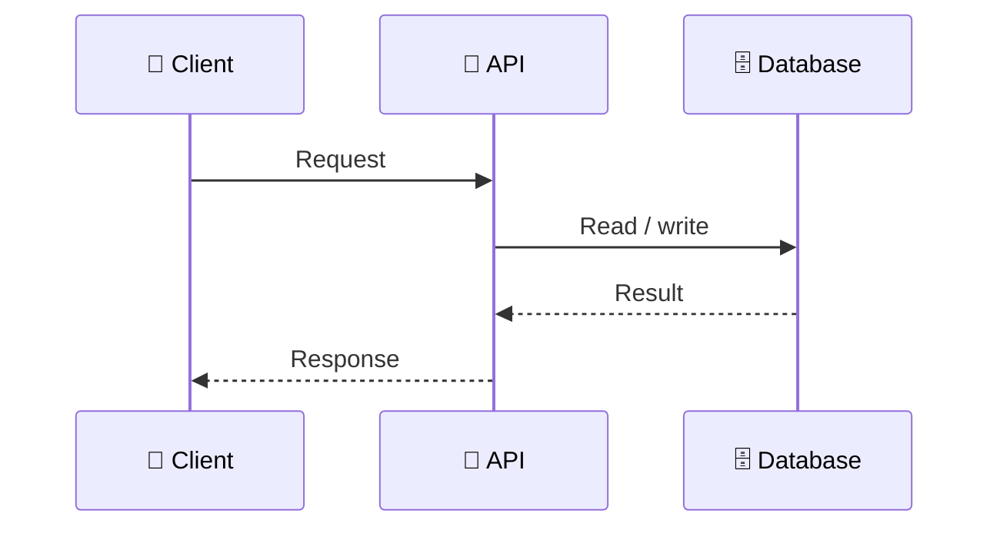
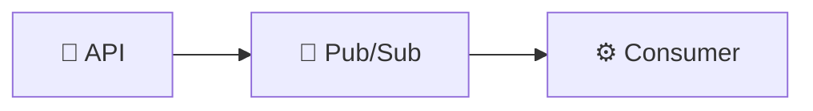
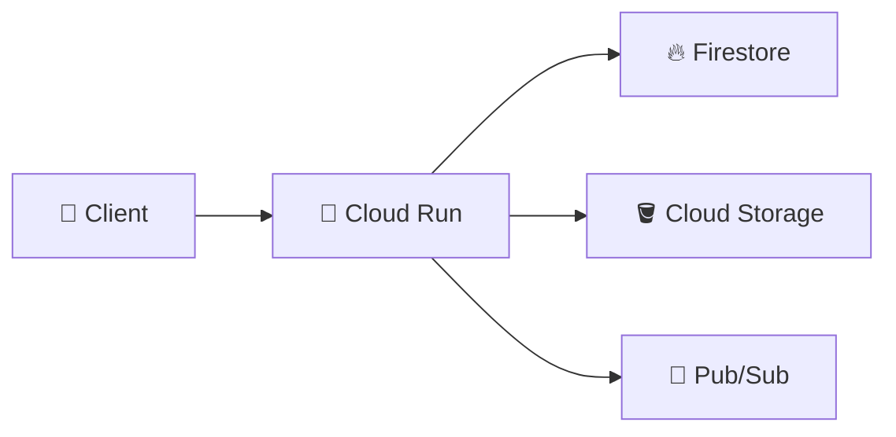
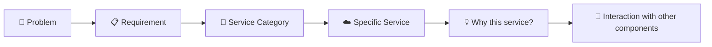

# 99. Chapter 1 Interview Questions 🎤

This section is intentionally placed at the end of the chapter so you can use it for revision and interview preparation.

> 💡 **Tip:** Try answering each question yourself before opening the answer.

## 🟢 Beginner Questions

### 1. What is GCP?

**Answer:**

GCP (Google Cloud Platform) is Google's cloud computing platform. It provides infrastructure and managed services that organizations can use to build, deploy, store, process, secure, and operate applications and data.

### 2. Is GCP a single product?

**Answer:**

❌ **No.** GCP is a collection of cloud services. Different services solve different problems such as compute, storage, databases, messaging, analytics, security, and observability.

### 3. What is a GCP project?

**Answer:**

A project is a central organizational boundary used by many GCP services. It provides a place to organize resources and associated configuration, APIs, permissions, and billing relationships.

### 4. What is a GCP resource?

**Answer:**

A resource is an individual cloud object created or used within the platform, such as a Cloud Storage bucket, Pub/Sub topic, Cloud Run service, or Cloud SQL instance.

### 5. What is the difference between a region and a zone?

**Answer:**

A region is a geographic area in which cloud resources can be hosted. A zone is a deployment area within a region. Resource location options depend on the specific GCP service.

### 6. What is the purpose of the `gcloud` CLI?

**Answer:**

`gcloud` is Google's command-line interface for interacting with Google Cloud services and managing GCP resources and configuration.

## 🟡 Intermediate Questions

### 7. Why do applications usually use multiple cloud services?

**Answer:**

Different services are designed to solve different problems. An application may use one service for compute, another for persistent data, another for object storage, and another for asynchronous messaging.

### 8. What is synchronous communication?

**Answer:**

In synchronous communication, the caller sends a request and generally waits for a response before continuing.

Example:

### 9. What is asynchronous communication?

**Answer:**

In asynchronous communication, the sender can submit work or an event without waiting for the downstream processing to finish.

Example:

### 10. Why is asynchronous communication useful?

**Answer:**

It can reduce coupling between services and allow work to be processed independently. It is useful when the caller does not need the downstream operation to finish before responding.

### 11. What is infrastructure abstraction?

**Answer:**

Infrastructure abstraction means that a platform or managed service handles some underlying infrastructure details for you. The amount of abstraction depends on the service you choose.

### 12. Does using a cloud platform mean developers have no infrastructure responsibilities?

**Answer:**

❌ **No.** Cloud providers manage parts of the underlying infrastructure, but customers still have responsibilities such as application code, configuration, data management, access policies, and service-specific operational decisions.

## 🔵 Architecture Questions

### 13. Why should you choose a GCP service based on a problem rather than its name?

**Answer:**

Because cloud services exist to solve specific classes of problems. Starting with the requirement makes it easier to evaluate the appropriate service instead of trying to force a familiar product into an unsuitable role.

### 14. Give an example of a simple GCP application architecture.

**Answer:**

One possible architecture is:

The exact architecture depends on the application's requirements.

### 15. Why might an application use Pub/Sub instead of directly calling several services?

**Answer:**

Pub/Sub can provide an event-driven communication mechanism in which the producer publishes an event and multiple consumers can independently process it.

### 16. What is the difference between an application architecture and a list of cloud services?

**Answer:**

A list only tells you which products are present. An architecture explains why those components exist, how they communicate, how data moves between them, and what responsibilities each component has.

## 🏠 Floci and Local Learning Questions

### 17. Why are we using Floci in this tutorial?

**Answer:**

Floci provides a local environment for practicing supported GCP-like services without requiring the corresponding real cloud resources for the local exercises.

### 18. Is Floci the same as real GCP?

**Answer:**

❌ **No.** It is an emulator/local development environment. It can help with learning and experimentation, but emulator behavior and supported features should not be assumed to be identical to real GCP.

### 19. Why are we not starting by creating a real GCP billing account?

**Answer:**

The tutorial is designed around a local-first learning workflow. This lets students practice supported service concepts without making real GCP billing part of the initial setup.

### 20. What should you validate when moving an application from a local emulator to real GCP?

**Answer:**

You should validate real authentication and authorization, networking, service availability, quotas, regional behavior, managed infrastructure behavior, scaling, reliability, observability, billing, security, and any service-specific differences.

## 🟣 Scenario Questions

### 21. Your restaurant application needs to store menu images. What type of service do you need?

**Answer:**

An object storage service. In GCP, Cloud Storage is designed for this type of workload.

### 22. Your restaurant application needs to store application documents. What category of service should you consider?

**Answer:**

A database service such as Firestore or Datastore may be appropriate depending on the data model and requirements.

### 23. Your application needs to run a containerized API. What category of service should you consider?

**Answer:**

A compute/container platform such as Cloud Run or GKE, depending on the application's operational and architectural requirements.

### 24. Your order API needs to notify multiple independent consumers when an order is created. What architectural pattern could you use?

**Answer:**

An event-driven pattern using a messaging or eventing service such as Pub/Sub can allow multiple consumers to process the event independently.

### 25. Your application is running, but you need to understand what happened during a failed request. Which capability should you look at?

**Answer:**

Observability capabilities such as logging and monitoring. Cloud Logging can help inspect logs, while Cloud Monitoring can help observe metrics and system behavior.

## 🎯 Interview Tip

Do not answer cloud interview questions by listing product names only.

A stronger explanation follows this pattern:

For example:

> **"We need to decouple order creation from downstream notification processing, so we can use an event-driven approach. Pub/Sub can carry the order-created event, allowing independent consumers to process it."**

That demonstrates architectural understanding rather than simple product memorization.
