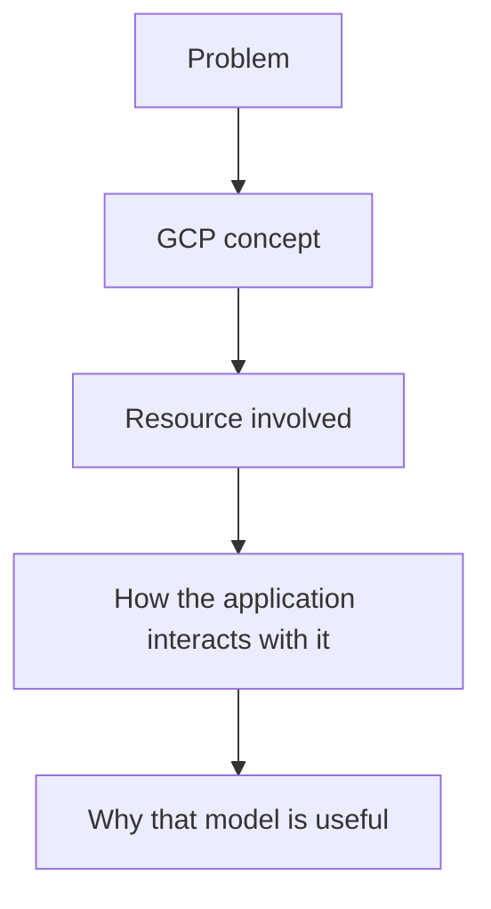
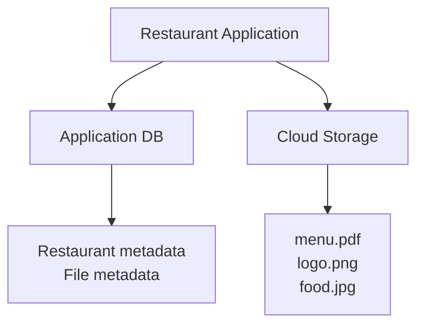

# 99. Chapter 3 Interview Questions 🎤

These questions focus on the concepts covered in **Chapter 3 — Cloud Storage Fundamentals**. Broader Cloud Storage topics such as IAM, signed URLs, lifecycle management, versioning, and application architecture are covered in the dedicated `INTERVIEW-PREP/03-Cloud-Storage.md` question bank.

## 🟢 Fundamentals

### 1. What is Google Cloud Storage?

### 2. What problem does object storage solve?

### 3. What is a bucket in Cloud Storage?

### 4. What is an object in Cloud Storage?

### 5. What is an object name?

### 6. What is the difference between a bucket and an object?

### 7. What does `gs://bucket-name/object-name` represent?

### 8. Why is Cloud Storage called object storage rather than traditional file storage?

## 📁 Object Names and Folders

### 9. Are folders real directories in Cloud Storage?

### 10. What does `restaurants/123/menu.pdf` represent in Cloud Storage?

### 11. Why can two objects named `menu.pdf` and `restaurants/123/menu.pdf` coexist in the same bucket?

### 12. What is an object prefix?

### 13. Why is understanding object names important when designing an application?

## 🪣 Bucket Concepts

### 14. What information belongs to a bucket rather than an individual object?

### 15. What is a bucket location?

### 16. What are the broad location types available for Cloud Storage buckets?

### 17. Why can bucket location matter to an application?

### 18. Why must applications choose bucket names carefully?

## 🛠️ CLI

### 19. What is `gcloud storage`?

### 20. How do you list buckets using `gcloud storage`?

### 21. How do you create a Cloud Storage bucket using `gcloud storage`?

### 22. How do you list objects in a bucket?

### 23. How do you upload a local file to Cloud Storage?

### 24. How do you download an object from Cloud Storage?

### 25. How do you delete an object?

### 26. In `gcloud storage cp ./menu.pdf gs://my-bucket/`, which side is the source and which side is the destination?

### 27. What is the difference between uploading and downloading an object with `gcloud storage cp`?

## 🧩 Scenario Questions

### 28. Your application runs on three servers and users upload images. Why might storing images on the servers' local disks become a problem?

### 29. Your application stores restaurant metadata in a database and restaurant menu PDFs in Cloud Storage. Why is this separation useful?

### 30. An object appears as `images/logo.png`. Does that prove that an `images` directory exists in the traditional filesystem sense? Explain.

### 31. You see `gs://restaurant-files/restaurants/123/menu.pdf`. Identify the bucket and object name.

### 32. A developer confuses `gs://restaurant-files` with `gs://restaurant-files/menu.pdf`. Explain the difference.

### 33. A developer uploads `menu.pdf` to one bucket and `restaurants/123/menu.pdf` to the same bucket. Can both objects exist? Why?

### 34. An interviewer asks why you would use Cloud Storage instead of Persistent Disk for user-uploaded images. How would you answer?

### 35. Your upload command succeeds but the application cannot find the file. What concepts would you check first?

## 🎯 Interview Answer Standard

For Chapter 3 questions, avoid answers that are only command memorization.

A strong answer should explain:

For example, for **"What is Cloud Storage?"**, a strong answer should mention that it is a managed object-storage service, explain buckets and objects, and describe why applications use it for files and other object data.

## 🧠 Final Challenge

Explain this architecture in your own words:

Your explanation should cover:

1. Why Cloud Storage is used.
2. What the bucket represents.
3. What the objects represent.
4. What an object name represents.
5. What information belongs in the database.
6. Why this is different from storing everything on an application server's local disk.
