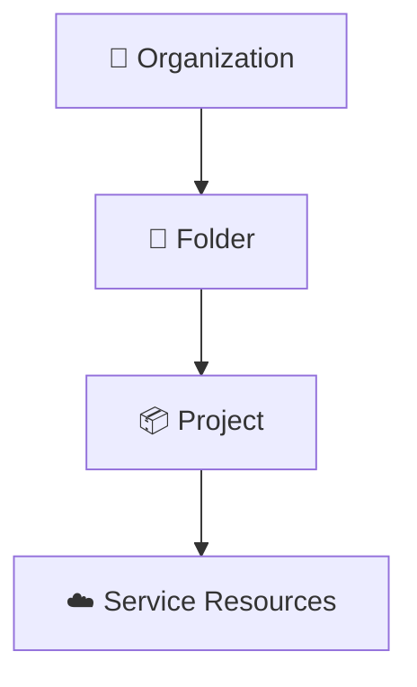
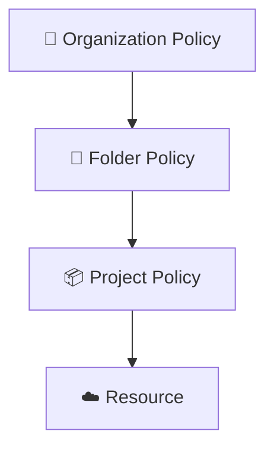
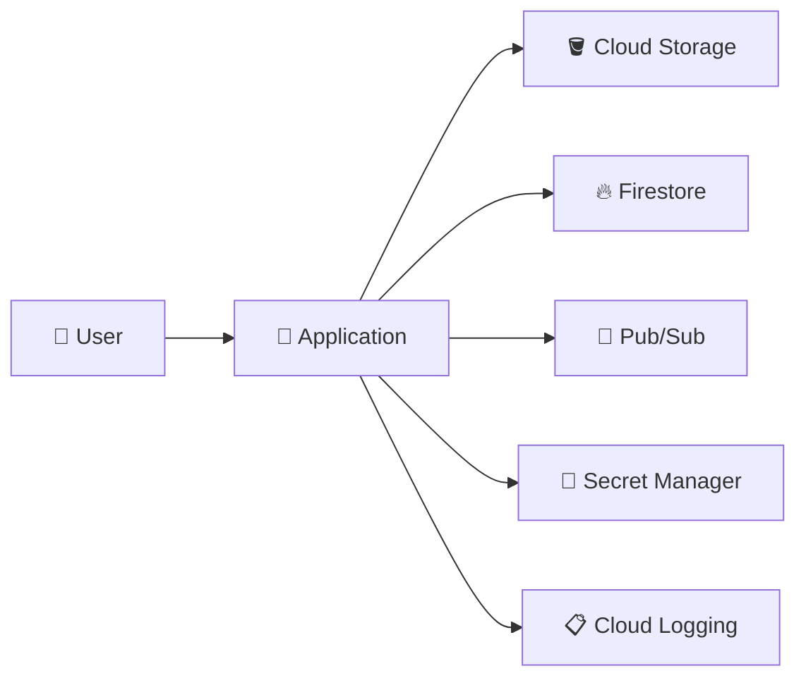
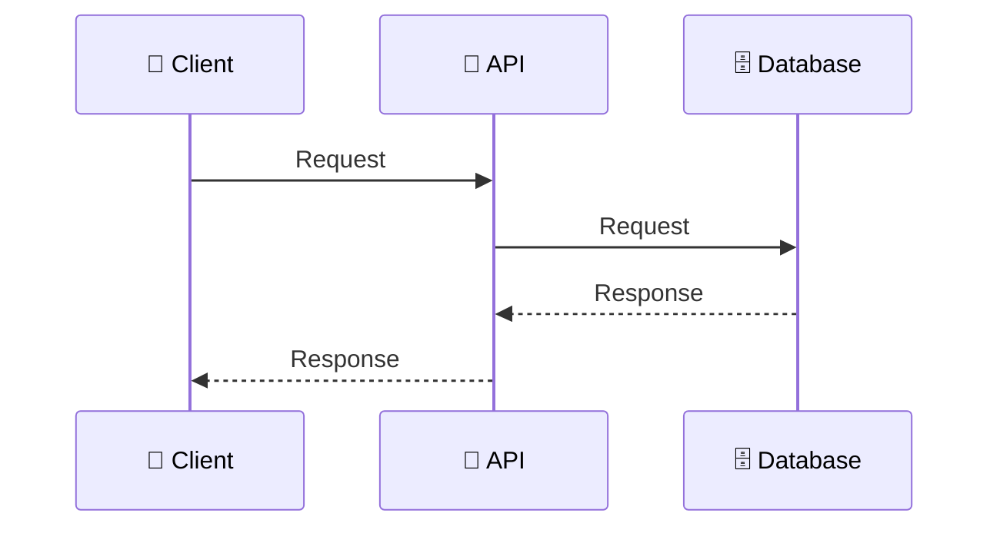
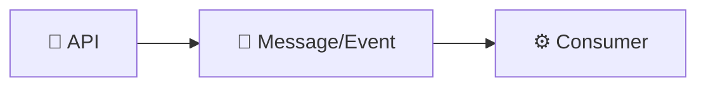
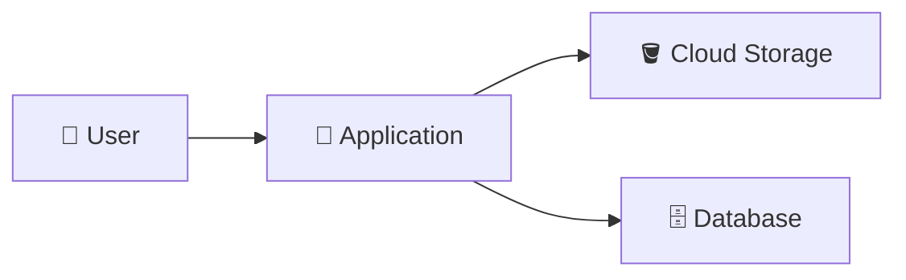
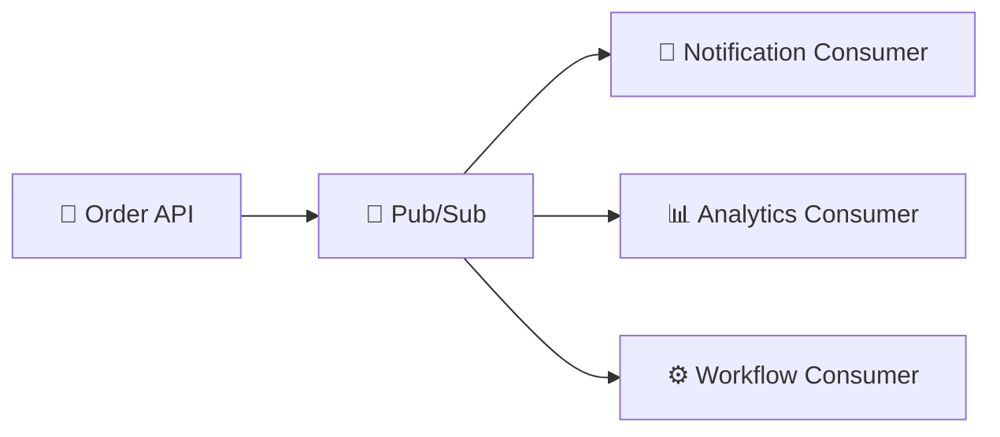
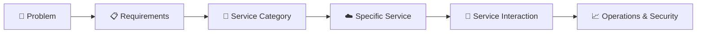

# 01. GCP Fundamentals & Core Concepts ☁️

This domain covers the foundational Google Cloud concepts expected in GCP interviews.

The questions are designed to test **understanding rather than memorization** and progress from fundamentals to architecture and troubleshooting.

> 💡 **Interview tip:** Try answering each question yourself before opening the answer.

---

## 🟢 Fundamentals

<details>
<summary><strong>1. What is Google Cloud Platform (GCP)?</strong></summary>

**Answer:**

Google Cloud Platform (GCP), now commonly referred to as Google Cloud, is Google's cloud computing platform. It provides infrastructure and managed services for running applications, storing and processing data, networking systems, managing identities, and operating workloads.

The important point is that GCP is not one product. It is a collection of services that can be combined to build and operate applications.

</details>

<details>
<summary><strong>2. Is GCP a single product?</strong></summary>

**Answer:**

❌ **No.** GCP is a collection of cloud services. Different services solve different problems, such as compute, storage, databases, messaging, analytics, security, networking, and observability.

A real application commonly combines multiple services rather than depending on one GCP product.

</details>

<details>
<summary><strong>3. Why do organizations use cloud platforms instead of managing all infrastructure themselves?</strong></summary>

**Answer:**

Cloud platforms allow organizations to consume infrastructure and managed services without having to purchase and operate every piece of physical infrastructure themselves.

For example, instead of purchasing physical servers, installing operating systems, managing hardware failures, and planning capacity manually, a team can use managed compute services and configure them through software and APIs.

Cloud does not remove all infrastructure responsibilities, but it changes how those responsibilities are managed.

</details>

<details>
<summary><strong>4. What is a GCP project?</strong></summary>

**Answer:**

A project is a fundamental organizing entity in Google Cloud. Resources such as virtual machines, storage resources, databases, and other service resources belong to projects.

Projects also provide an important boundary for configuration, permissions, APIs, and cost tracking.

Think of a project as a major container in which an application or workload's cloud resources are organized.

</details>

<details>
<summary><strong>5. What are a project name, project ID, and project number?</strong></summary>

**Answer:**

A GCP project has three commonly encountered identifiers:

- **Project name:** Human-readable display name.
- **Project ID:** A unique identifier used to reference the project in many commands and APIs.
- **Project number:** A Google-generated numeric identifier.

For example, when using the Google Cloud CLI, you commonly specify a project ID with:

```bash
gcloud config set project PROJECT_ID
```

</details>

<details>
<summary><strong>6. What is a GCP resource?</strong></summary>

**Answer:**

A resource is an individual cloud object managed by Google Cloud.

Examples include:

- Compute Engine VM
- Cloud Storage bucket
- Pub/Sub topic
- Cloud Run service
- Cloud SQL instance
- BigQuery dataset

Resources generally belong to a project, although the exact resource hierarchy and scope depend on the service.

</details>

<details>
<summary><strong>7. What is the difference between a region and a zone?</strong></summary>

**Answer:**

A **region** is a geographic area containing Google Cloud infrastructure. A **zone** is a deployment area within a region.

For example, a zone such as `asia-east1-a` belongs to the `asia-east1` region.

The distinction matters because different resources have different location scopes. Some resources are global, some regional, and some zonal.

</details>

<details>
<summary><strong>8. What are global, regional, and zonal resources?</strong></summary>

**Answer:**

They describe the geographic scope in which a resource operates.

- **Global:** Can be used across regions within the applicable Google Cloud universe.
- **Regional:** Associated with a particular region.
- **Zonal:** Associated with a particular zone.

For example, Google Cloud documentation describes networks as global resources, some IP addresses as regional resources, and Compute Engine VM instances as zonal resources.

Understanding resource scope is important when designing applications and connecting resources together.

</details>

<details>
<summary><strong>9. Why do regions and zones matter when designing a cloud application?</strong></summary>

**Answer:**

Location affects factors such as latency, availability, resource compatibility, and data placement.

For example, placing workloads closer to users can reduce network latency. Using multiple zones can also help an application tolerate certain failures within a region.

The correct location strategy depends on the application's requirements rather than simply choosing the closest-looking region.

</details>

<details>
<summary><strong>10. What is the `gcloud` CLI?</strong></summary>

**Answer:**

`gcloud` is the Google Cloud command-line interface. It allows developers and operators to interact with Google Cloud services, configure projects and accounts, create and manage resources, and automate cloud operations through scripts.

For example:

```bash
gcloud config set project my-project
```

The CLI provides a scriptable alternative to performing many operations through the Google Cloud Console.

</details>

---

## 🟡 Core Concepts

<details>
<summary><strong>11. What is the Google Cloud resource hierarchy?</strong></summary>

**Answer:**

The resource hierarchy organizes Google Cloud resources into levels:



An organization is the root when an organization resource exists. Folders are optional grouping mechanisms, projects are the primary organizing boundary for service resources, and service resources exist underneath projects.

This hierarchy is also important for access control and policy inheritance.

</details>

<details>
<summary><strong>12. Why are folders used in Google Cloud?</strong></summary>

**Answer:**

Folders provide an optional way to group projects and other folders within an organization.

For example, an organization might use folders for departments or environments:

```text
Organization
├── Engineering
│   ├── Development Project
│   └── Production Project
└── Finance
    └── Finance Project
```

Folders can also act as policy and access-control boundaries.

</details>

<details>
<summary><strong>13. What is IAM in Google Cloud?</strong></summary>

**Answer:**

IAM stands for **Identity and Access Management**. It controls who or what can access Google Cloud resources and what actions they are allowed to perform.

A useful mental model is:

> **Principal + Role + Resource = Access**

For example, a user or service account can receive a role that grants specific permissions on a project or resource.

</details>

<details>
<summary><strong>14. What is the difference between authentication and authorization?</strong></summary>

**Answer:**

**Authentication** answers:

> "Who are you?"

**Authorization** answers:

> "What are you allowed to do?"

For example, successfully proving that you are a particular Google identity is authentication. Having permission to create a Cloud Storage bucket is authorization.

Keeping these concepts separate is fundamental to understanding IAM.

</details>

<details>
<summary><strong>15. What is a service account?</strong></summary>

**Answer:**

A service account is an identity intended for applications, workloads, or other automated processes rather than a human user.

For example, an application running on a Google Cloud service can use an appropriate service account identity when accessing another Google Cloud service.

Service accounts become particularly important when learning workload identity and least-privilege access.

</details>

<details>
<summary><strong>16. What does the principle of least privilege mean?</strong></summary>

**Answer:**

Least privilege means granting an identity only the permissions it actually needs to perform its job.

For example, if an application only needs to read objects from a bucket, it should not automatically receive broad administrative permissions across the project.

Least privilege reduces the impact of compromised credentials or application mistakes.

</details>

<details>
<summary><strong>17. How does IAM policy inheritance work in the resource hierarchy?</strong></summary>

**Answer:**

IAM policies can be applied at different levels of the resource hierarchy. Permissions granted at a parent resource can be inherited by descendant resources, depending on the policy and resource type.

For example:



This allows organizations to manage common access rules centrally instead of configuring every resource independently.

</details>

<details>
<summary><strong>18. What is the difference between the Google Cloud Console and `gcloud`?</strong></summary>

**Answer:**

The **Google Cloud Console** is a web-based graphical interface for managing Google Cloud resources.

The **`gcloud` CLI** provides command-line access to Google Cloud functionality and is especially useful for repeatable operations, scripting, automation, and development workflows.

They are different interfaces for interacting with Google Cloud; using the CLI does not mean the Console is a different cloud platform.

</details>

---

## 🔵 Architecture & Scenario Questions

<details>
<summary><strong>19. Why do modern applications commonly use multiple GCP services?</strong></summary>

**Answer:**

Different services specialize in different workloads.

For example, an application might use:



The application uses each service for a particular responsibility instead of implementing storage, messaging, secrets, and observability itself.

</details>

<details>
<summary><strong>20. What is the difference between synchronous and asynchronous communication?</strong></summary>

**Answer:**

In **synchronous communication**, the caller generally waits for the downstream operation to return a response.



In **asynchronous communication**, the sender can submit work or publish an event without waiting for the downstream consumer to finish processing it.



Pub/Sub is an example of a service used for asynchronous messaging.

</details>

<details>
<summary><strong>21. Why might an application use asynchronous communication?</strong></summary>

**Answer:**

Asynchronous communication can reduce coupling between components and allow downstream work to be processed independently.

For example, when an order is created, the API might publish an `order-created` event. Independent consumers could then process notifications, analytics, or other work without requiring the API request to wait for every operation.

The choice depends on the application's consistency, latency, reliability, and workflow requirements.

</details>

<details>
<summary><strong>22. Your application needs to store user-uploaded images. What type of GCP service should you consider?</strong></summary>

**Answer:**

You should consider an **object storage** service such as Cloud Storage.

A typical architecture could be:



The image itself can be stored as an object, while application metadata such as the image owner, filename, or URL can be stored separately according to the application's data model.

</details>

<details>
<summary><strong>23. Your application needs to run a containerized API. What GCP service categories could you evaluate?</strong></summary>

**Answer:**

You could evaluate managed container platforms such as **Cloud Run** or Kubernetes-based platforms such as **GKE**.

The choice should be based on requirements such as:

- Operational complexity
- Kubernetes-specific requirements
- Networking requirements
- Workload behavior
- Scaling requirements
- Platform control

The correct interview answer is not simply "always use Cloud Run" or "always use GKE." You should explain the requirements that drive the decision.

</details>

<details>
<summary><strong>24. Your order API needs to notify several independent consumers whenever an order is created. What architecture could you use?</strong></summary>

**Answer:**

An event-driven architecture using a messaging service such as Pub/Sub could be appropriate.

For example:



The producer publishes the event once, while independent consumers can process the event for their own responsibilities.

The exact design should also consider retries, duplicate processing, ordering requirements, failure handling, and idempotency.

</details>

<details>
<summary><strong>25. Your application is running, but a request is failing and you need to understand what happened. What GCP capabilities should you investigate?</strong></summary>

**Answer:**

Start with **observability**.

Depending on the architecture, this can include:

- 📋 **Cloud Logging** — inspect application and infrastructure logs.
- 📈 **Cloud Monitoring** — inspect metrics, dashboards, and alerts.
- 🔎 Request or trace information — when the architecture and services provide the relevant telemetry.

A good troubleshooting process is to move from the symptom to evidence rather than guessing the cause.

For example:

```text
Request failed
     ↓
Check logs
     ↓
Identify error/time window
     ↓
Check relevant metrics
     ↓
Inspect dependent services
     ↓
Identify root cause
```

</details>

---

## 🎯 Interview Challenge

After completing these questions, try answering this without looking at the answers:

> **"Design a simple restaurant ordering application on GCP. Explain which services you would use, what responsibility each service has, and how the services communicate."**

A strong answer should explain the **problem → requirements → service category → specific service → communication → operational considerations** rather than simply listing GCP products.



---

## 📚 What This Domain Covers

By completing these 25 questions, you should be comfortable discussing:

- ✅ What Google Cloud is
- ✅ Projects and resources
- ✅ Project identifiers
- ✅ Regions and zones
- ✅ Global, regional, and zonal resources
- ✅ Resource hierarchy
- ✅ Organizations and folders
- ✅ IAM fundamentals
- ✅ Authentication vs authorization
- ✅ Service accounts
- ✅ Least privilege
- ✅ IAM inheritance
- ✅ Google Cloud Console vs `gcloud`
- ✅ Synchronous vs asynchronous communication
- ✅ Multi-service application architecture
- ✅ Basic GCP architecture decisions
- ✅ Observability and troubleshooting concepts
