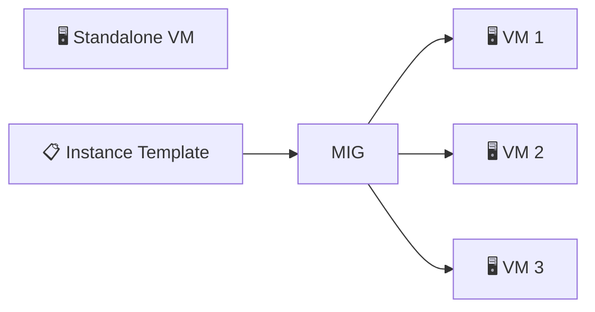
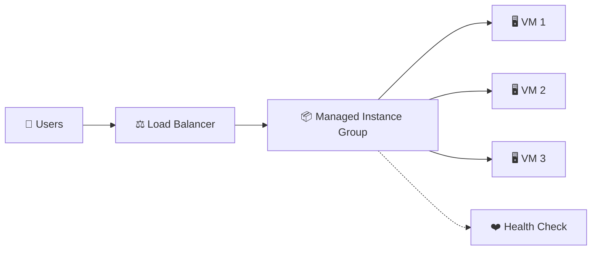
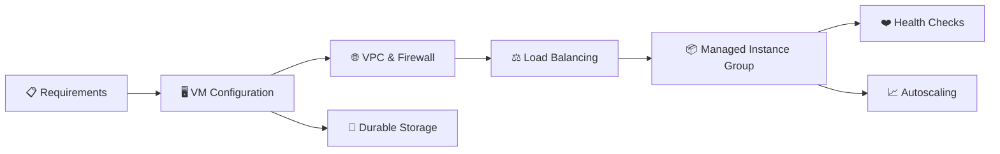

# 02. Compute Engine 🖥️

This domain covers **Google Compute Engine**, Google's Infrastructure-as-a-Service (IaaS) offering for running virtual machines and bare metal instances.

The questions progress from VM fundamentals to machine configuration, storage, networking, deployment strategies, scaling, and troubleshooting.

> 💡 **Interview tip:** Try answering each question yourself before opening the answer.

---

## 🟢 Fundamentals

<strong>1. What is Google Compute Engine?</strong>

**Answer:**

Compute Engine is Google Cloud's IaaS service for creating and running virtual machines (VMs) and, for supported machine types, bare metal instances on Google's infrastructure.

It gives you significant control over the machine's operating system, machine type, disks, networking, and other configuration.

<strong>2. What is a Compute Engine instance?</strong>

**Answer:**

A Compute Engine instance is a compute resource that runs on Google infrastructure. Depending on the selected machine type, an instance can be a virtual machine or a bare metal instance.

In normal usage, when engineers say "Compute Engine instance," they usually mean a VM.

<strong>3. How is Compute Engine different from a traditional physical server?</strong>

**Answer:**

A traditional physical server is hardware that an organization purchases and operates. A Compute Engine VM is a virtualized compute resource provided by Google Cloud.

With Compute Engine, you can select machine resources, images, disks, networking, and other settings through the cloud platform instead of physically installing and maintaining the server.

However, Compute Engine still gives you much more operating-system and infrastructure control than highly managed services such as Cloud Run.

<strong>4. Is Compute Engine a managed service?</strong>

**Answer:**

Compute Engine is a cloud infrastructure service, but the VM itself is largely **self-managed** from the customer's perspective.

Google manages the underlying cloud infrastructure, while you are responsible for many guest operating system and workload-level concerns such as software installation, OS configuration, application processes, and access configuration.

This is an important distinction from more fully managed compute platforms.

<strong>5. What is a machine type in Compute Engine?</strong>

**Answer:**

A machine type defines the compute resources allocated to an instance, such as the number of vCPUs and amount of memory.

Compute Engine provides predefined machine types and supports custom machine types for applicable machine series.

For example, a machine type such as `n2-standard-4` represents a particular CPU and memory configuration.

<strong>6. What is a machine family?</strong>

**Answer:**

A machine family groups machine series designed for particular workload characteristics.

Google Cloud provides families such as:

- 🧰 General-purpose
- ⚡ Compute-optimized
- 🧠 Memory-optimized
- 🌐 Network-optimized
- 💾 Storage-optimized
- 🎮 Accelerator-optimized

The family should be selected according to workload requirements rather than simply choosing the largest VM.

<strong>7. What is the difference between a predefined and custom machine type?</strong>

**Answer:**

A **predefined machine type** provides a fixed combination of vCPUs and memory.

A **custom machine type**, where supported, allows you to choose a CPU and memory configuration more closely matched to your workload.

Custom machine types can be useful when standard configurations do not provide a suitable resource ratio.

<strong>8. What is a vCPU in Compute Engine?</strong>

**Answer:**

A vCPU is a virtual CPU presented to the VM. The relationship between vCPUs and physical CPU cores depends on the machine series and its CPU architecture/SMT configuration.

For interviews, the important point is that the machine type determines the number of vCPUs available to the instance, along with its memory and other capabilities.

---

## 🟡 VM Configuration & Storage

<strong>9. What is an image when creating a Compute Engine VM?</strong>

**Answer:**

An image is a source used to create the VM's boot disk and operating system environment.

You can use public images provided by Google Cloud or other supported image sources, or use custom images when you need a customized operating-system and software configuration.

The image is different from the machine type: the image defines the software starting point, while the machine type defines compute resources.

<strong>10. What is a boot disk?</strong>

**Answer:**

The boot disk is the disk from which the VM boots its operating system.

When creating an instance, you typically select an OS image and configure the boot disk's size and disk type.

A VM can also have additional non-boot disks for application data.

<strong>11. What is the difference between Persistent Disk, Hyperdisk, and Local SSD?</strong>

**Answer:**

They are different Compute Engine storage options with different performance, durability, and management characteristics.

- **Persistent Disk:** Durable block storage that remains available when a VM is stopped.
- **Hyperdisk:** High-performance durable block storage with configurable performance characteristics for supported machine series.
- **Local SSD:** Physically attached high-performance storage with ephemeral behavior; data on Local SSD can be lost when the VM stops or is otherwise removed according to the Local SSD lifecycle.

The choice depends on workload performance, durability, and cost requirements.

<strong>12. What happens to data on a Local SSD when a VM is stopped?</strong>

**Answer:**

Local SSD is ephemeral storage. Data stored on an attached Local SSD is not durable in the same way as Persistent Disk or Hyperdisk.

If the instance is stopped, the data on its Local SSD is lost.

Therefore, Local SSD should not be treated as the only copy of important persistent application data.

<strong>13. Can a Compute Engine VM have more than one disk?</strong>

**Answer:**

✅ **Yes.** A VM can have a boot disk and one or more additional attached disks, subject to the applicable service and machine limits.

A common design is to keep the operating system on the boot disk and application data on separate data disks.

This can make storage management and lifecycle decisions clearer.

<strong>14. What is a snapshot used for in Compute Engine?</strong>

**Answer:**

A snapshot provides a point-in-time copy of supported disk data that can be used for data protection and recovery workflows.

Snapshots can be useful when you need to protect disk data before making significant changes or when you need a recoverable copy of a disk.

Snapshots should be considered part of a broader backup and recovery strategy rather than automatically assuming they satisfy every disaster-recovery requirement.

<strong>15. What is an instance template?</strong>

**Answer:**

An instance template defines configuration settings used to create VM instances.

It can capture settings such as the machine type, boot disk/image, metadata, and other VM configuration.

Instance templates are especially important when creating groups of consistently configured VMs, such as Managed Instance Groups.

---

## 🔵 Networking & Deployment

<strong>16. What networking configuration does a Compute Engine VM need?</strong>

**Answer:**

A VM needs a network interface connected to a VPC network and subnet. The interface can have an internal IP address and may also use an external IP address when required.

Networking configuration can also involve firewall rules, routes, DNS, IP forwarding, and other network settings depending on the workload.

The VM's compute configuration and its network configuration are separate concerns that work together.

<strong>17. What is the difference between an internal IP and an external IP for a Compute Engine VM?</strong>

**Answer:**

An **internal IP** is used for communication within the applicable Google Cloud networking environment and connected networks.

An **external IP** provides public internet reachability when the relevant network and firewall configuration allow it.

A VM does not automatically need a public IP. For many backend workloads, keeping the VM private is preferable when public exposure is unnecessary.

<strong>18. What is a firewall rule in the context of Compute Engine?</strong>

**Answer:**

A firewall rule controls whether network traffic is allowed or denied according to the applicable VPC firewall policy and rule configuration.

For example, an HTTP server may need an appropriate rule allowing inbound traffic to its serving port.

A common troubleshooting mistake is to check whether the application is running but forget to verify that network access is actually permitted.

<strong>19. What is a Managed Instance Group (MIG)?</strong>

**Answer:**

A Managed Instance Group is a collection of VM instances managed as a group, typically using an instance template.

MIGs can provide capabilities such as:

- 🔄 Automatic instance replacement / autohealing
- 📈 Autoscaling for applicable stateless workloads
- ⚖️ Load-balancer integration
- 🌍 Multi-zone deployment for regional MIGs
- 🔁 Controlled updates

They are useful when an application needs more than one consistently configured VM.

<strong>20. What is the difference between a standalone VM and a Managed Instance Group?</strong>

**Answer:**

A **standalone VM** is managed as an individual instance.

A **Managed Instance Group** manages a collection of instances according to a desired configuration and can provide automation such as autoscaling, autohealing, and rolling updates.

For example:

A MIG is generally more appropriate when you need a fleet of similar VMs rather than one individually managed machine.

<strong>21. Why would you deploy a MIG across multiple zones?</strong>

**Answer:**

A regional Managed Instance Group can distribute VM instances across multiple zones within a region.

This can improve availability by reducing dependence on a single zone. If one zone experiences an issue, the group can continue operating with instances in other zones, depending on capacity and the application's design.

Multi-zone deployment is not the same thing as automatically achieving disaster recovery across regions.

---

## 🟠 Troubleshooting & Scenarios

<strong>22. A VM is running, but you cannot connect to it over SSH. What would you investigate?</strong>

**Answer:**

Do not immediately assume the VM itself is broken. Investigate the connection path systematically:

1. ✅ Confirm that the VM is actually running.
2. ✅ Check that the correct IP address or connection method is being used.
3. ✅ Check VPC firewall rules for the required SSH traffic.
4. ✅ Check whether the VM has an appropriate network interface and route.
5. ✅ Verify SSH credentials, OS user configuration, and access permissions.
6. ✅ Check whether the guest operating system's SSH service is running.
7. ✅ Check whether there are organization or project-level policies affecting access.

The key interview skill is to separate **network connectivity problems** from **authentication/authorization problems** and **guest OS problems**.

<strong>23. Your application on a Compute Engine VM is running out of CPU. What options could you consider?</strong>

**Answer:**

First, confirm the actual bottleneck using metrics rather than immediately increasing the VM size.

Possible options include:

- 📈 Resize the VM to a machine type with more CPU.
- 🔀 Add more VM instances and distribute traffic across them.
- ⚙️ Optimize the application or workload causing CPU pressure.
- 📊 Use autoscaling through a suitable Managed Instance Group for workloads that support horizontal scaling.

The correct choice depends on whether the problem is caused by a single-instance limitation, workload design, or a temporary traffic spike.

<strong>24. Your company needs a web application that can scale horizontally and automatically replace unhealthy VMs. How could you design it with Compute Engine?</strong>

**Answer:**

A common Compute Engine design would use a **Managed Instance Group** based on an instance template, together with a load balancer and health checking.

The MIG can provide mechanisms such as autoscaling and autohealing, while the load balancer distributes traffic across healthy instances.

The exact configuration depends on the application, protocol, regional requirements, and availability goals.

<strong>25. When would you choose Compute Engine instead of a more managed compute service such as Cloud Run?</strong>

**Answer:**

Compute Engine is useful when the workload requires VM-level control or capabilities that fit an IaaS model.

Examples can include:

- 🖥️ Custom operating-system configuration
- ⚙️ Specialized software or system-level dependencies
- 🧰 Workloads requiring deeper VM control
- 🏗️ Existing applications that are designed around traditional servers
- 🔧 Requirements that are not a good fit for a serverless container platform

Cloud Run provides a more managed container execution model. Compute Engine gives you more control but also more operational responsibility.

A strong interview answer should explain the **workload requirement and trade-off**, rather than claiming that one service is universally better.

---

## 🎯 Interview Challenge

Try answering this without opening the answers:

> **"Design a highly available restaurant web application using Compute Engine. Explain how you would handle VM configuration, networking, traffic distribution, scaling, health checks, and storage."**

A strong answer should connect these concepts:

---

## 📚 What This Domain Covers

By completing these 25 questions, you should be comfortable discussing:

- ✅ Compute Engine fundamentals
- ✅ VM instances
- ✅ IaaS vs more managed compute models
- ✅ Machine families and machine types
- ✅ vCPUs and memory
- ✅ Public and custom images
- ✅ Boot and additional disks
- ✅ Persistent Disk, Hyperdisk, and Local SSD
- ✅ Snapshots
- ✅ Instance templates
- ✅ VPC networking and firewall concepts
- ✅ Internal vs external IP addresses
- ✅ Managed Instance Groups
- ✅ Autoscaling and autohealing concepts
- ✅ Multi-zone deployment
- ✅ SSH troubleshooting
- ✅ VM capacity problems
- ✅ Compute Engine architecture decisions
