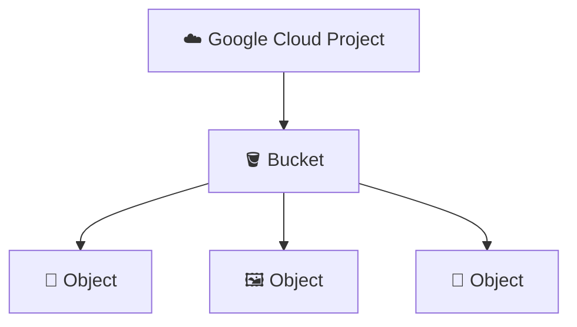
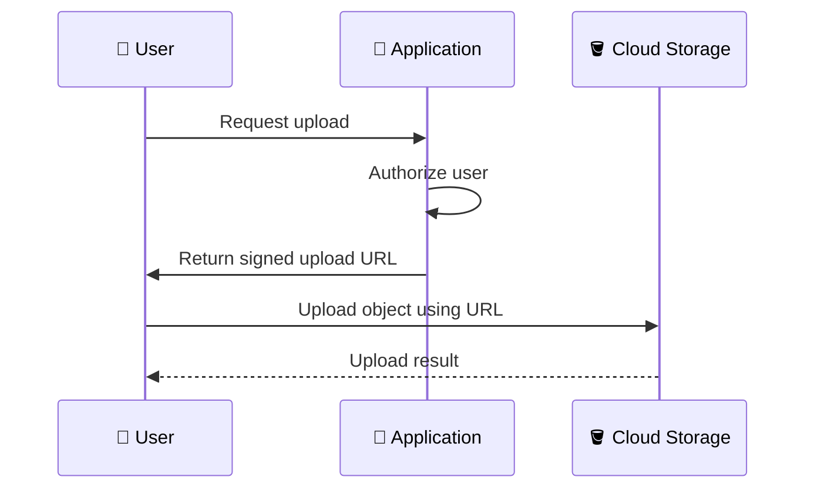
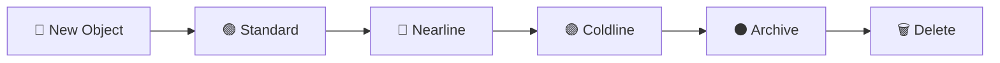
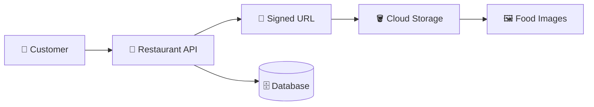
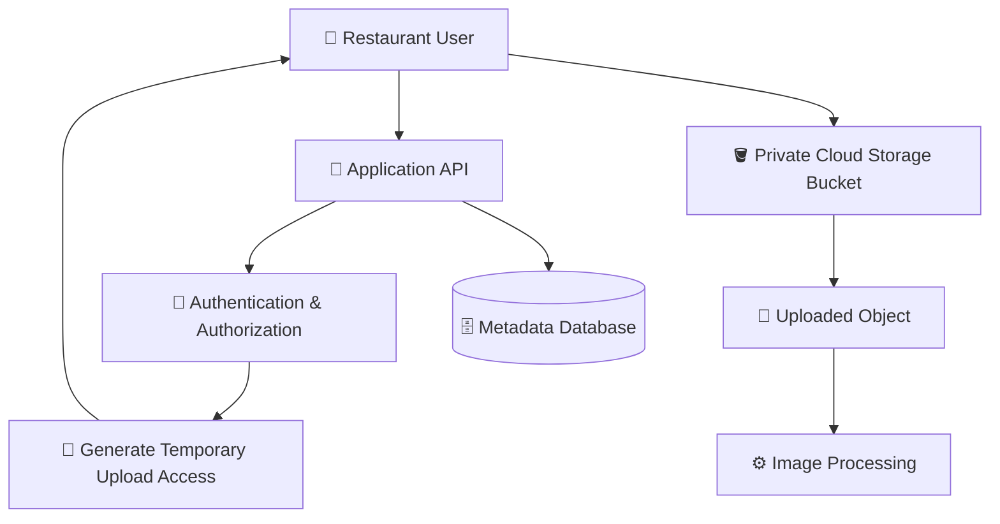
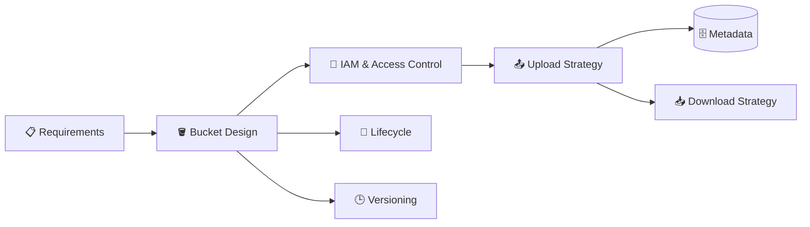

# 03. Cloud Storage 🪣

This domain covers **Google Cloud Storage**, Google's managed object storage service.

The questions move from storage fundamentals into buckets and objects, storage classes, access control, lifecycle management, versioning, signed URLs, consistency, performance, and real-world troubleshooting.

> 💡 **Interview tip:** Try answering each question yourself before opening the answer.

---

## 🟢 Fundamentals

<details>
<summary><strong>1. What is Google Cloud Storage?</strong></summary>

**Answer:**

Cloud Storage is Google's managed **object storage** service. It stores data as **objects** inside **buckets**.

Typical objects include:

- 🖼️ Images
- 🎥 Videos
- 📄 Documents
- 📦 Backups
- 🧾 Logs
- 🗃️ Application-generated files

Unlike a traditional filesystem, Cloud Storage is designed around buckets and objects rather than folders and files on a mounted disk.

</details>

<details>
<summary><strong>2. What is the difference between a bucket and an object?</strong></summary>

**Answer:**

A **bucket** is the container in which Cloud Storage objects are stored.

An **object** is the actual piece of data stored in the bucket, together with metadata.

A simple mental model is:

```text
Cloud Storage
└── Bucket
    ├── Object: menu.jpg
    ├── Object: invoice.pdf
    └── Object: restaurant-logo.png
```

The bucket provides the storage namespace and configuration, while the object represents the stored data.

</details>

<details>
<summary><strong>3. Is Cloud Storage the same as a traditional filesystem?</strong></summary>

**Answer:**

❌ **No.** Cloud Storage is object storage, not a traditional POSIX filesystem.

Objects have names that can contain `/`, which can make them look like directory paths, for example:

```text
restaurant/images/logo.png
restaurant/invoices/2026/001.pdf
```

But those separators do not turn Cloud Storage into a normal filesystem with directories and filesystem semantics.

</details>

<details>
<summary><strong>4. What is the basic hierarchy of Cloud Storage?</strong></summary>

**Answer:**

The basic model is:



A project can contain buckets, and buckets contain objects.

A bucket is associated with a location and has settings such as access control, storage class, and lifecycle configuration.

</details>

<details>
<summary><strong>5. What makes Cloud Storage different from Compute Engine Persistent Disk?</strong></summary>

**Answer:**

They solve different storage problems.

| Cloud Storage | Persistent Disk |
|---|---|
| Object storage | Block storage |
| Accessed through storage APIs/tools | Attached to compute instances |
| Good for files, media, backups, data exchange | Good for VM operating systems and application filesystems |
| Bucket/object model | Disk/block-device model |

For example, a restaurant application could store uploaded food images in Cloud Storage while its Compute Engine VM uses Persistent Disk for its operating system and local application filesystem needs.

</details>

<details>
<summary><strong>6. What is the `gcloud storage` command used for?</strong></summary>

**Answer:**

`gcloud storage` is the Google Cloud CLI command group used to work with Cloud Storage resources.

For example:

```bash
gcloud storage buckets list
gcloud storage buckets create gs://my-example-bucket
gcloud storage cp ./menu.jpg gs://my-example-bucket/
gcloud storage ls gs://my-example-bucket/
```

The exact command and available options should be checked against the installed Google Cloud CLI version when practicing.

</details>

<details>
<summary><strong>7. What is a globally unique bucket name?</strong></summary>

**Answer:**

A Cloud Storage bucket name must satisfy Cloud Storage's naming requirements and be globally unique within the applicable Cloud Storage namespace.

This means another user or project may already have taken a name you want to use.

For example, a generic name such as:

```text
restaurant-images
```

may already exist. A more specific name is usually easier to make unique.

</details>

---

## 🟡 Storage Classes & Locations

<details>
<summary><strong>8. What are Cloud Storage storage classes?</strong></summary>

**Answer:**

Storage classes are designed for different access patterns and cost requirements.

Common classes include:

- 🟢 **Standard** — frequent access
- 🔵 **Nearline** — infrequent access
- 🟣 **Coldline** — less frequent access
- ⚫ **Archive** — long-term archival data

The storage class affects storage pricing and, depending on the class and usage pattern, retrieval-related costs and minimum storage-duration considerations.

</details>

<details>
<summary><strong>9. How would you choose between Standard, Nearline, Coldline, and Archive?</strong></summary>

**Answer:**

Start with the application's access pattern rather than choosing based only on the storage price.

For example:

- Frequently accessed website images → **Standard**
- Data accessed occasionally → **Nearline**
- Data rarely accessed → **Coldline**
- Long-term archival data that is rarely retrieved → **Archive**

The final decision should also consider retrieval charges, minimum storage durations, operational requirements, and the current pricing model.

</details>

<details>
<summary><strong>10. What is a bucket location?</strong></summary>

**Answer:**

A bucket's location determines where its data is stored geographically according to the selected Cloud Storage location type.

Cloud Storage supports locations such as:

- 🌍 Regions
- 🌎 Dual-regions
- 🌐 Multi-regions, where supported

Location choice can affect latency, availability characteristics, data residency requirements, and cost.

</details>

<details>
<summary><strong>11. Why does bucket location matter in system design?</strong></summary>

**Answer:**

Bucket location can influence:

- ⚡ Application latency
- 🌍 Geographic availability requirements
- 💰 Network and storage-related costs
- 📍 Data residency requirements
- 🔄 How data is positioned relative to other services

For example, if an application primarily runs in one region, placing frequently accessed data appropriately can help reduce unnecessary latency and cross-region data movement.

</details>

---

## 🔐 Access Control & Security

<details>
<summary><strong>12. How is access to Cloud Storage controlled?</strong></summary>

**Answer:**

Cloud Storage access can be controlled using **Identity and Access Management (IAM)** and, depending on the configuration and access model, other Cloud Storage access-control mechanisms.

IAM permissions determine what identities can do with buckets and objects.

Examples include permissions to:

- View objects
- Create objects
- Delete objects
- Configure buckets
- Manage IAM policies

A good production design follows least privilege instead of making a bucket broadly public.

</details>

<details>
<summary><strong>13. What is the difference between authentication and authorization for Cloud Storage?</strong></summary>

**Answer:**

**Authentication** answers:

> "Who are you?"

**Authorization** answers:

> "What are you allowed to do?"

For example, an application may authenticate using a service account identity, and IAM then determines whether that identity can create or read objects in a particular bucket.

</details>

<details>
<summary><strong>14. What does least privilege mean for a Cloud Storage application?</strong></summary>

**Answer:**

Least privilege means giving an identity only the permissions it actually needs.

For example, if an image-processing service only needs to read objects from one bucket, it should not automatically receive broad administrative access to every storage resource in the project.

This reduces the impact of credential misuse or application compromise.

</details>

<details>
<summary><strong>15. How would you allow users to upload files without making the entire bucket public?</strong></summary>

**Answer:**

A common pattern is to keep the bucket private and let the application generate a **signed URL** for a specific object operation.

The client can then upload directly to Cloud Storage using the temporary URL, without receiving broad bucket permissions.



The exact signed URL mechanism and constraints depend on the application's requirements.

</details>

<details>
<summary><strong>16. What is a signed URL?</strong></summary>

**Answer:**

A signed URL is a URL containing authentication information that grants temporary access to a specific Cloud Storage resource or operation.

It is useful when a client needs temporary access without receiving long-lived credentials or broad IAM permissions.

Typical use cases include:

- 📤 Direct browser uploads
- 📥 Temporary downloads
- 🖼️ Controlled access to private media

A signed URL should be treated as a credential for its validity period and scope.

</details>

---

## 🔄 Lifecycle, Versioning & Reliability

<details>
<summary><strong>17. What is Object Versioning in Cloud Storage?</strong></summary>

**Answer:**

Object Versioning allows Cloud Storage to retain noncurrent versions of objects when objects are replaced or deleted according to the service's versioning behavior.

This can help recover from accidental overwrites or deletions.

However, retaining versions can increase storage usage and cost, so it should be combined with appropriate lifecycle management.

</details>

<details>
<summary><strong>18. What is an Object Lifecycle Management policy?</strong></summary>

**Answer:**

A lifecycle policy automatically performs actions on objects when specified conditions are met.

For example, a policy might transition objects to another storage class after a certain age or delete objects after a defined retention period, depending on the configured rules.



The actual lifecycle transitions must follow the storage classes, minimum-duration rules, and lifecycle actions supported by Cloud Storage.

</details>

<details>
<summary><strong>19. Why can Object Versioning and Lifecycle Management be used together?</strong></summary>

**Answer:**

Versioning protects against certain accidental changes by retaining older object versions, while lifecycle management can control how long those versions remain stored.

For example:

```text
Application
   ↓
Overwrite object
   ↓
New current version
   ↓
Older version retained
   ↓
Lifecycle rule eventually removes old version
```

Without lifecycle rules, retained versions can accumulate and increase storage usage.

</details>

<details>
<summary><strong>20. Is Cloud Storage suitable for backups?</strong></summary>

**Answer:**

✅ **Yes.** Cloud Storage can be used as part of a backup architecture.

It is well suited to storing backup files, exports, archives, and other objects outside the primary compute environment.

However, a backup design should also consider retention, deletion protection, encryption, access control, geographic requirements, recovery procedures, and testing. Simply copying a file to a bucket does not by itself prove that a disaster-recovery strategy works.

</details>

---

## 🟠 Troubleshooting & Real-World Scenarios

<details>
<summary><strong>21. Your application gets "permission denied" when uploading an object. What would you check?</strong></summary>

**Answer:**

Investigate the identity and the exact resource involved:

1. 🔍 Identify which identity is making the request.
2. 🔐 Check whether that identity is authenticated correctly.
3. 🪣 Confirm the target bucket and object path.
4. 👤 Check IAM permissions granted to the identity.
5. 🧩 Check whether organization, project, or bucket-level policies affect access.
6. 🚫 Check whether the request is attempting an operation that the identity is not permitted to perform.
7. 🧪 Reproduce the operation using the same identity and tool where possible.

The important interview point is to distinguish **authentication**, **authorization**, and **resource/configuration** problems.

</details>

<details>
<summary><strong>22. A restaurant application stores thousands of uploaded food images. Would you store them in Cloud Storage or directly on a VM's disk?</strong></summary>

**Answer:**

For the image objects themselves, Cloud Storage is generally a natural fit because it is designed for object storage and can be accessed independently of an individual VM.

A common architecture is:



The database can store metadata such as the object name, restaurant ID, and image information, while Cloud Storage stores the actual image data.

</details>

<details>
<summary><strong>23. An object exists in Cloud Storage, but your application cannot download it. What could be wrong?</strong></summary>

**Answer:**

Possible causes include:

- 🔐 The application's identity lacks object-read permission.
- 🪣 The application is accessing the wrong bucket.
- 📝 The object name/path is incorrect.
- 🔑 A signed URL has expired or was generated incorrectly.
- 🚫 A bucket or organization policy is restricting access.
- 🌐 The application is using the wrong endpoint or environment configuration.

Start by identifying the exact request, identity, bucket, object name, and error response before changing permissions.

</details>

<details>
<summary><strong>24. Your application needs to serve a large number of images to users. Why might you avoid routing every image through your application server?</strong></summary>

**Answer:**

Sending every image through the application server can make the application server handle traffic that could instead be served directly from object storage or an appropriate delivery layer.

A common pattern is to let the application handle authorization and metadata while clients retrieve permitted objects through suitable Cloud Storage access mechanisms.

This can reduce application-server bandwidth and processing requirements and can separate application traffic from large object transfers.

The exact architecture depends on whether the objects are public, private, cacheable, and subject to authorization requirements.

</details>

<details>
<summary><strong>25. Design a secure file-upload system for a restaurant application using Cloud Storage.</strong></summary>

**Answer:**

One reasonable design is:



Key design considerations:

- Keep the bucket private unless public access is genuinely required.
- Authenticate and authorize the user before issuing upload access.
- Prefer temporary, scoped access for direct client uploads where appropriate.
- Validate file type and size in the application workflow.
- Store object metadata separately when the application needs searchable business data.
- Apply lifecycle rules where old objects should eventually expire or transition.
- Consider versioning and retention requirements.
- Apply least-privilege IAM to application identities.

The exact implementation depends on the application's security, compliance, upload-size, and processing requirements.

</details>

---

## 🎯 Interview Challenge

Try answering this without opening the answers:

> **"Design a file-storage architecture for a restaurant SaaS platform where each restaurant can upload menus, logos, invoices, and food images. Explain bucket organization, access control, upload flow, lifecycle management, and how your application stores object metadata."**

A strong answer should connect:



---

## 📚 What This Domain Covers

By completing these 25 questions, you should be comfortable discussing:

- ✅ Object storage fundamentals
- ✅ Buckets and objects
- ✅ Cloud Storage vs block storage
- ✅ `gcloud storage`
- ✅ Bucket naming
- ✅ Storage classes
- ✅ Bucket locations
- ✅ IAM and access control
- ✅ Authentication vs authorization
- ✅ Least privilege
- ✅ Signed URLs
- ✅ Object Versioning
- ✅ Lifecycle Management
- ✅ Backup use cases
- ✅ Upload/download architectures
- ✅ Permission troubleshooting
- ✅ Large-object delivery patterns
- ✅ Secure application file-storage design
