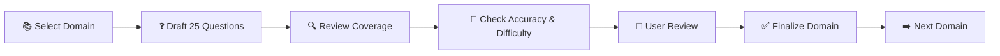

# 🎤 GCP Interview Preparation

This section is a dedicated interview-preparation track for the **Floci GCP Tutorial**.

The goal is not to memorize product definitions. The question bank will progressively test:

- 🟢 Fundamentals and core concepts
- 🟡 Practical usage and commands
- 🔵 Architecture and design decisions
- 🟠 Troubleshooting and debugging
- 🔴 Real-world scenarios
- 🎯 Interview follow-up and deeper questions

Each domain will have its **own Markdown file** containing approximately **25 carefully selected questions**.

> 💡 **Approach:** We will build and review one domain at a time instead of generating the entire question bank at once. This keeps the questions relevant, non-repetitive, technically accurate, and aligned with the tutorial.

---

## 📚 Domains

| # | Domain | Questions | Status |
|---|---|---:|---|
| 01 | 🟢 GCP Fundamentals & Core Concepts | 25 | ⬜ Planned |
| 02 | 🖥️ Compute Engine | 25 | ⬜ Planned |
| 03 | 🪣 Cloud Storage | 25 | ⬜ Planned |
| 04 | 🔥 Firestore | 25 | ⬜ Planned |
| 05 | 🗄️ Datastore | 25 | ⬜ Planned |
| 06 | 🐘 Cloud SQL | 25 | ⬜ Planned |
| 07 | 📊 BigQuery | 25 | ⬜ Planned |
| 08 | 📨 Pub/Sub | 25 | ⬜ Planned |
| 09 | ⚙️ Cloud Functions | 25 | ⬜ Planned |
| 10 | 🚀 Cloud Run | 25 | ⬜ Planned |
| 11 | ☸️ GKE & Kubernetes | 25 | ⬜ Planned |
| 12 | 📦 Cloud Tasks | 25 | ⬜ Planned |
| 13 | ⏰ Cloud Scheduler | 25 | ⬜ Planned |
| 14 | 🔔 Eventarc | 25 | ⬜ Planned |
| 15 | 🔐 IAM | 25 | ⬜ Planned |
| 16 | 👤 Service Accounts & Application Identity | 25 | ⬜ Planned |
| 17 | 🔑 Secret Manager | 25 | ⬜ Planned |
| 18 | 🔒 KMS & Encryption | 25 | ⬜ Planned |
| 19 | 📋 Cloud Logging | 25 | ⬜ Planned |
| 20 | 📈 Cloud Monitoring & Observability | 25 | ⬜ Planned |
| 21 | 🌐 GCP Networking & VPC | 25 | ⬜ Planned |
| 22 | 🏗️ GCP Application Architecture | 25 | ⬜ Planned |
| 23 | 💰 Billing, Cost & Resource Management | 25 | ⬜ Planned |
| 24 | 🔥 Firebase & Authentication | 25 | ⬜ Planned |
| 25 | 🔄 IAM Credentials, STS & Federation | 25 | ⬜ Planned |
| 26 | 📡 Kafka & Event Streaming | 25 | ⬜ Planned |
| 27 | 🧪 Troubleshooting & Debugging | 25 | ⬜ Planned |
| 28 | 🍽️ Real-World System Design Scenarios | 25 | ⬜ Planned |
| 29 | 🔀 Multi-Service GCP Scenarios | 25 | ⬜ Planned |
| 30 | 🎯 Advanced GCP Interview Questions | 25 | ⬜ Planned |

**Planned coverage: 30 domains × 25 questions = approximately 750 questions.**

---

## 📁 File Structure

Each domain will eventually have its own Markdown file:

```text
INTERVIEW-PREP/
├── README.md
├── 01-GCP-Fundamentals.md
├── 02-Compute-Engine.md
├── 03-Cloud-Storage.md
├── 04-Firestore.md
├── 05-Datastore.md
├── ...
└── 30-Advanced-GCP-Interview-Questions.md
```

The exact filenames can be adjusted as the domains are finalized.

---

## 🧠 Question Design

Each 25-question domain will aim for a balanced mix rather than 25 definition-based questions:

| Question Type | Approx. Coverage |
|---|---:|
| 🟢 Fundamentals | 7–8 |
| 🟡 Practical / Commands | 4–5 |
| 🔵 Architecture / Design | 4–5 |
| 🟠 Troubleshooting | 3–4 |
| 🔴 Real-world Scenarios | 3–4 |
| 🎯 Advanced / Follow-up | 1–2 |

The exact distribution may change depending on the domain.

---

## 🔄 Development Process

We will create the question bank incrementally:



### Quality checks

Before a domain is finalized, we will check for:

- ✅ Duplicate or overly similar questions
- ✅ Appropriate difficulty progression
- ✅ Practical interview relevance
- ✅ Scenario and troubleshooting coverage
- ✅ Alignment with the tutorial chapters
- ✅ Clear and understandable answers
- ✅ Appropriate GCP terminology
- ✅ Questions that test understanding rather than memorization

---

## 📌 Current Plan

The existing interview questions from **Chapter 1** are being treated as the starting point for the dedicated interview-preparation track.

We will **not generate all domains at once**. Each domain will be developed as a separate batch, reviewed, and then committed to this directory.
